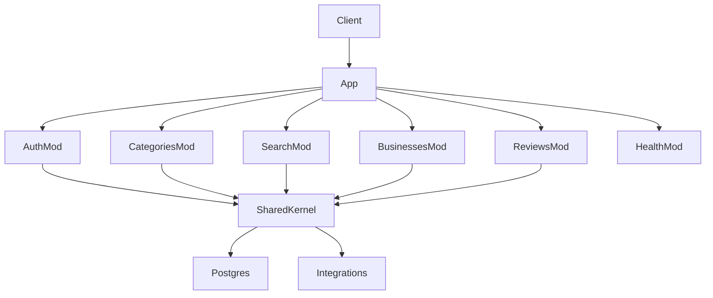

# Backend Modular Structure (Microservice-Ready)

## Goal

Keep **one runnable Express + Postgres process** (current Docker Compose stays), but reorganize code into **domain modules** so each can later become its own service with minimal rewrite. This matches [Architeture.md](Architeture.md): modular services (search, listings, booking, payments, etc.) without premature multi-repo / multi-DB complexity.

**Default chosen:** modular monolith now; extract services later by cutting along module folders.

---

## Target layout

```
apps/api/src/
  main.ts                          # bootstrap only (listen, shutdown)
  app.ts                           # createExpressApp(): middleware + mount modules
  config/
    env.ts                         # Zod-validated env (JWT, DB, CORS, seed flags)
    constants.ts
  shared/                          # cross-cutting kernel (never depends on modules)
    errors/
    middleware/                    # requestId, optional rate-limit hook, error handlers
    auth/                          # JWT cookie helpers, requireAuth, requireRole
    db/                            # prisma client singleton
    integrations/                  # email (stub), future sms/payments adapters
    utils/                         # slugify, pagination helpers
    types/
  modules/
    health/
    auth/
    categories/
    search/
    businesses/
    reviews/
    # Scaffolded empty/stub modules (Architecture roadmap):
    bookings/
    payments/
    messaging/
    ads/
    analytics/
    notifications/
  platform/
    compose-routers.ts             # mounts all module routers under /api
```

**Per existing module (auth, categories, search, businesses, reviews):**

```
modules/<name>/
  index.ts           # public module API: { router, ... }
  <name>.routes.ts   # Express Router + Zod parse only
  <name>.service.ts  # business rules
  <name>.repository.ts  # Prisma queries only
  <name>.schemas.ts  # Zod request/response schemas
  <name>.types.ts    # domain types (DTO-ish, not Prisma leakage where practical)
```

Stub modules (bookings, payments, …) get the same folders with a `README.md` note + empty router returning `501` only for clearly-not-MVP routes, **or** no mount until implemented—prefer **unmounted scaffold** so public API surface stays unchanged.

---

## Module map (from Architecture + current API)

| Module | Owns today | Future extraction |
|--------|------------|-------------------|
| `auth` | register/login/logout/me, cookies | Identity service |
| `categories` | category tree | Catalog service |
| `search` | listing search/filters | Search service (+ Redis/ES later) |
| `businesses` | CRUD/detail, ownership | Listings service |
| `reviews` | reviews + rating aggregates | Reviews service |
| `health` | `/api/health` + DB ping | Keep on gateway/API |
| `bookings` / `payments` / `messaging` / `ads` / `analytics` / `notifications` | scaffold only | Per Architecture deferred features |



**Dependency rule (enforced by convention + lint comment / short ADR in README):**  
`modules/*` may import `shared/*` and their own files. Modules must **not** import other modules’ internals. Cross-domain needs go through a small shared helper (e.g. `recalculateListingRating` in `shared/db` or `reviews` exporting a service function used only via a defined port later). For MVP extract: put shared listing visibility + rating aggregate helpers in `shared/domain/` so businesses/reviews stop duplicating logic.

---

## Production / scalability hooks (lightweight, real)

Without standing up Redis/Kafka yet, bake in seams:

1. **Config** — [`config/env.ts`](apps/api/src/config/env.ts): Zod parse of `DATABASE_URL`, `JWT_SECRET`, `NODE_ENV`, `CORS_ORIGIN`, `PORT`, `RUN_SEED`; fail fast on boot.
2. **Structured logging** — thin `shared/logging/logger.ts` (pino or console JSON wrapper) with `requestId` middleware; replace ad-hoc `console.log` in email stub.
3. **Health** — keep DB check; add readiness vs liveness shape (`status`, `database`, `uptime`) for Compose/K8s later.
4. **Error contract** — keep [`ApiError`](apps/api/src/lib/errors.ts) in `shared/errors`; consistent JSON `{ error, code?, requestId? }`.
5. **Rate limit middleware stub** — no-op or simple in-memory limiter behind env flag (`RATE_LIMIT_ENABLED`), so Redis-backed limiter plugs in later.
6. **Integration adapters** — `shared/integrations/email.ts` interface (`send`); same pattern reserved for `sms`, `payments` folders.
7. **Path aliases** — add `@/` → `src/` in `tsconfig` + keep ESM `.js` import endings compatible with NodeNext (use relative if alias tooling is painful; prefer `tsc-alias` or stick to relative within modules—**choose relative imports inside modules + short paths from `shared` to avoid build risk**).

Prisma stays **one schema** in [`apps/api/prisma`](apps/api/prisma) for the monolith. Document that microservice split later = extract tables per service + sync/events—not part of this change.

---

## Migration steps (no behavior change)

1. Create folder skeleton + move shared kernel (`errors`, `auth` middleware, `prisma`, `email`).
2. Split each fat route file into `routes` / `service` / `repository` / `schemas` for: auth, categories, search, businesses, reviews.
3. Deduplicate: pending-business visibility + review rating recalculation → `shared/domain/`.
4. Wire `app.ts` + `platform/compose-routers.ts`; `main.ts` boots only.
5. Add stub module folders for Architecture roadmap domains (unmounted).
6. Update Dockerfile/`docker-entrypoint` only if entry path changes (`dist/main.js`).
7. Update [`apps/api` README section or root README](README.md): module map, dependency rules, how to add a module, how to extract a microservice later.
8. Verify: `npm run typecheck && npm run lint && npm run build`, then `docker compose up --build` smoke (health, auth, search, businesses, reviews).

**Public HTTP API stays identical** so [`apps/web`](apps/web) needs no changes.

---

## Explicit non-goals

- Not splitting into multiple Docker services / databases yet  
- Not implementing bookings/payments/messaging features  
- Not adding Elasticsearch/Redis as required dependencies  
- Not changing Prisma schema unless needed for shared helper types  

---

## Success criteria

- Clear `modules/<domain>` ownership; routes thin; services testable without Express  
- Shared kernel has config, auth, db, errors, logging, integrations  
- Future domains scaffolded and documented  
- Existing MVP endpoints and Docker Compose behavior unchanged  
- README explains “add a module” and “extract a service” paths
