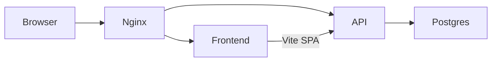

# Concierge Design-Matched MVP Plan

## Scope (locked)

**In MVP (docker-compose deliverable):**
- Pages from HTML: Home, Category/Search Listings, Business Detail (unified template covering Elite Build + Aura patterns)
- Auth (register/login/logout, JWT, roles: `user` | `business` | `admin`)
- Categories hierarchy, search + filters, business listings CRUD (owner), reviews/ratings
- Seed data matching design mock businesses (Elite Build, Aura Interior, Brett Architects, etc.)
- Stubbed maps (Leaflet + OpenStreetMap), stubbed email (console log), no real payment/SMS keys

**Explicitly deferred (post-MVP phases):** Bookings, Payments, Ads, Messaging, Business analytics dashboard, Admin moderation UI, OAuth, Redis, Elasticsearch, voice search

---

## Target architecture



| Service | Image/role |
|---------|------------|
| `db` | `postgres:16` |
| `api` | Node Express API (port 3001 internal) |
| `web` | Vite-built React SPA served by nginx (port 80) |
| Reverse proxy | nginx in `web` proxies `/api` → `api:3001` |

Single entry: `http://localhost:8080` → SPA + `/api/*`.

---

## Monorepo layout

```
concierge/
  docker-compose.yml
  .env.example
  README.md
  apps/
    web/                 # React + Vite + Tailwind + shadcn
    api/                 # Express + Prisma + Postgres
  packages/              # optional shared types later; skip for MVP
  design/                # move existing HTML here as reference
    home.html
    listing.html
    ...
```

Preserve [Architeture.md](Architeture.md) and move the four HTML files into `design/` so they remain the visual source of truth.

---

## Backend (`apps/api`)

**Stack:** Express, TypeScript, Prisma ORM, Zod validation, bcrypt + JWT (HttpOnly cookie preferred), multer/local disk for images in MVP (volume-mounted).

### Prisma schema (MVP tables)

Aligned with [Architeture.md](Architeture.md) but simplified:

- `User` — id (uuid), name, email, phone, passwordHash, role, createdAt
- `Category` — id, name, slug, parentId, icon, sortOrder
- `Business` — id, ownerId, name, slug, email, phone, logoUrl, verified, status (`pending`|`active`), createdAt
- `Listing` — id, businessId, categoryId, title, description, address, city, lat, lng, hours (JSON), images (string[]), website, avgRating, reviewCount, featured
- `Review` — id, userId, businessId, rating (1–5), comment, createdAt (unique user+business)
- `Favorite` — optional thin MVP: userId + businessId (nav “account” can show saved later; include if cheap)

Indexes: GIN/full-text on `Listing.title` + `description` (Prisma `unsupported` or raw SQL migration), btree on categoryId, city; lat/lng for near queries (simple bounding-box filter in MVP).

### REST API (MVP)

| Method | Path | Notes |
|--------|------|-------|
| POST | `/api/auth/register` | role default `user` |
| POST | `/api/auth/login` | sets JWT cookie |
| POST | `/api/auth/logout` | |
| GET | `/api/auth/me` | |
| GET | `/api/categories` | tree |
| GET | `/api/search` | `q`, `city`, `category`, `lat/lng`, `rating`, `open`, `page` |
| GET | `/api/businesses/:slugOrId` | detail + reviews preview |
| POST | `/api/businesses` | auth business/admin — create listing |
| PATCH | `/api/businesses/:id` | owner only |
| GET | `/api/reviews?businessId=` | paginated |
| POST | `/api/reviews` | auth user |
| DELETE | `/api/reviews/:id` | author or admin |

Health: `GET /api/health`.

### Seed (`prisma/seed.ts`)

Populate from HTML mocks:
- Categories: Restaurants, Hotels, Beauty & Spa, Home Decor, Real Estate, Medical, B2B, Contractors, etc.
- Businesses: Elite Build & Masonry, Aura Interior & Furniture, Brett Architects, Terra & Stone, Arcadian Structures, Heritage Artisan Group
- Demo users: `user@demo.com` / `business@demo.com` / `admin@demo.com` (password in README)
- Sample reviews and ratings matching listing cards (4.7–5.0)

### Integrations (stubs)

- **Maps:** API returns lat/lng; frontend renders Leaflet — no Google key
- **Email:** `EmailService` logs to stdout (`[email] to=... subject=...`)
- **Payments/SMS:** not in MVP

---

## Frontend (`apps/web`)

**Stack:** Vite + React 19 + TypeScript, React Router, Tailwind CSS v4 (or v3 matching shadcn), shadcn/ui, TanStack Query, react-hook-form + Zod, Leaflet.

### Design system port from HTML

Port tokens from [home.html](home.html) into CSS variables / Tailwind theme:

- Fonts: **Manrope** (body/display), **Hanken Grotesk** (label-caps)
- Colors: `primary #000000`, `secondary #7a5820`, `secondary-container #fed08c`, surfaces `#fcf8fa` / `#f0edef`, etc.
- Spacing: `container-max 1280px`, `gutter 24px`, section gaps
- Icons: Material Symbols Outlined (same as HTML) or Lucide via shadcn where buttons/forms need it — prefer Material Symbols for parity with designs

shadcn components used for interactive chrome only (Button, Input, Dialog, Form, Select, Sheet, Avatar, Badge, Skeleton) — page layouts stay compositional like the HTML, not card-dashboard heavy.

### Routes (match design flow)

| Route | Source design | Behavior |
|-------|---------------|----------|
| `/` | `home.html` | Hero, pillars, search bar, category grid, industry sections, Elite CTA, footer |
| `/listings` | `listing.html` | Filters + verified partners grid; query params from search |
| `/listings/:categorySlug` | same | Pre-filtered by category/pillar |
| `/business/:slug` | Elite Build + Aura HTML | Unified profile: hero, about/stats, products/collections, gallery/projects, CTA; layout variants via listing type or sections from API |
| `/login`, `/register` | new (minimal, on-brand) | Auth |
| `/account` | thin | Profile + user’s reviews (MVP) |

Wire nav: Concierge → `/`, pillars/categories → `/listings?...`, listing cards → `/business/:slug`, List Business → register/business create flow (simple form page `/list-business` for authenticated business users).

### Data wiring

- Search form on home → `/listings?q=&city=`
- Listing page fetches `GET /api/search` + filters
- Detail fetches `GET /api/businesses/:slug` + reviews; write review dialog if logged in
- Leaflet map on detail (and optional mini-map on listings) using stub coords from seed

Keep HTML files in `design/` and convert section-by-section into React components under `apps/web/src/pages/` and `apps/web/src/components/`.

---

## Docker Compose

[`docker-compose.yml`](docker-compose.yml) services:

1. **db** — Postgres 16, volume `pgdata`, healthcheck
2. **api** — build `apps/api`, wait for db, run `prisma migrate deploy && prisma db seed && node dist/index.js`, volume for uploads
3. **web** — multi-stage: build Vite → nginx; `nginx.conf` proxies `/api` to `api:3001`

Env via `.env` / `.env.example`:
`POSTGRES_USER`, `POSTGRES_PASSWORD`, `POSTGRES_DB`, `DATABASE_URL`, `JWT_SECRET`, `API_PORT`, `VITE_API_URL` (empty when same-origin via nginx)

**Run:** `docker compose up --build` → open `http://localhost:8080`

Also document local dev without Docker: `api` on 3001, `web` Vite on 5173 with proxy.

---

## Implementation phases (execution order)

### Phase 1 — Scaffold & Docker skeleton
- Create `apps/web` (Vite React TS) and `apps/api` (Express TS)
- Add Prisma, docker-compose, nginx, `.env.example`, README with demo credentials
- Move HTML → `design/`
- Prove `docker compose up` serves a hello page + `/api/health`

### Phase 2 — Database + Auth + Seed
- Prisma schema + migrations
- Auth routes + middleware (role guards)
- Seed script with design businesses/categories
- CORS/cookies for same-origin and Vite proxy

### Phase 3 — Core APIs
- Categories, search (full-text + filters), business detail, reviews
- Image upload endpoint (optional; seed can use external image URLs from HTML)

### Phase 4 — Frontend design system + pages
- Theme tokens + fonts + shadcn init
- Shared `TopNav`, `Footer`
- Port Home → Listings → Business Detail
- Auth pages + review submit + search navigation

### Phase 5 — Polish & verify
- Loading/empty/error states, responsive checks vs HTML
- Seed walkthrough in README
- `docker compose up --build` end-to-end smoke checklist

### Later (not in this MVP)
- Bookings, stub payments, business dashboard, admin panel, ads, messaging, Redis, real Stripe/Maps keys

---

## Key files to create

- [docker-compose.yml](docker-compose.yml), [.env.example](.env.example)
- [apps/api/prisma/schema.prisma](apps/api/prisma/schema.prisma), [apps/api/src/index.ts](apps/api/src/index.ts)
- [apps/web/src/App.tsx](apps/web/src/App.tsx), pages: `Home`, `Listings`, `BusinessDetail`, `Auth`
- [apps/web/nginx.conf](apps/web/nginx.conf)
- [README.md](README.md) — replace stub with run instructions

## Success criteria

1. `docker compose up --build` starts db + api + web with no external API keys
2. Home matches Concierge design language (fonts, black primary, secondary gold accents)
3. Search/category → listings → business detail works against Postgres seed data
4. Demo user can register/login and post a review
5. Leaflet map shows on business detail using seed coordinates
