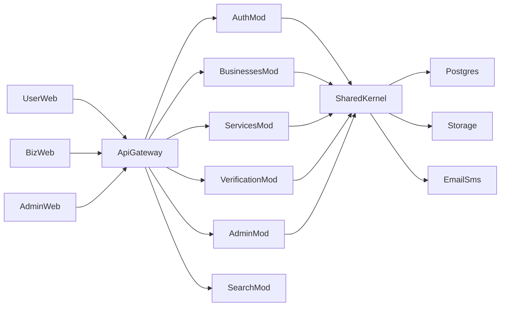

# Production Feature Roadmap (Audit → Implement)

## Audit verdict (current state)

| # | Feature | Status |
|---|---------|--------|
| 1 | Business registration & onboarding | **PARTIAL** — signup/login + create listing; no OTP; UI missing hours/logo/cover uploads |
| 2 | Business public profile | **PARTIAL** — core fields + map; no cover field, social links, services, logo UI |
| 3 | Business services CRUD | **MISSING** |
| 5 | Photo / identity verification | **MISSING** (only boolean `verified`) |
| 6 | Super admin | **PARTIAL** — admin role + PATCH flags; no list/search/suspend/delete UI or APIs |
| 7 | User registration & login | **PARTIAL** — cookie JWT works; no OTP, no profile photo |
| 8 | Search & discovery | **PARTIAL** — name/city/category; no service search, no nearby geo |

**Security baseline today:** HttpOnly JWT cookie, bcrypt, Zod, role/owner checks, CORS allowlist — solid MVP, not yet production-complete (rate limit off by default, no OTP, no upload authz, no tests, dead legacy `src/routes` still in tree).

**Defaults locked for this plan:**
- OTP/email/SMS stay behind adapters; local/dev logs codes to console (same pattern as current email stub); real Twilio/SendGrid via env when keys exist
- Uploads: local Docker volume + `StoragePort` interface (S3-ready later)
- Admin soft-delete via `status: suspended | deleted`; hard delete admin-only with cascade rules
- Automated tests: Vitest + Supertest for API modules (priority); Playwright smoke later

---

## Phase 0 — Hardening & cleanup (1 sprint slice)

- Delete or quarantine dead legacy code: [`apps/api/src/routes`](apps/api/src/routes), [`apps/api/src/lib`](apps/api/src/lib), [`apps/api/src/middleware`](apps/api/src/middleware), [`apps/api/src/index.ts`](apps/api/src/index.ts) if still present — only modular [`src/main.ts`](apps/api/src/main.ts) path is live
- Turn on rate limiting for auth + upload endpoints by default in production (`RATE_LIMIT_ENABLED` + stricter auth bucket)
- Add CSRF defense for cookie auth: double-submit `X-CSRF-Token` or SameSite=strict for mutating routes in production
- Structured audit log helper for admin actions
- Test harness: Vitest + Supertest + test DB (Docker service `db_test` or schema `concierge_test`)

---

## Phase 1 — Auth verification + user profile (features 7 + part of 1)

**Schema additions** on `User`:
- `emailVerifiedAt`, `phoneVerifiedAt`
- `avatarUrl`
- `VerificationChallenge` table: `id`, `userId`, `channel` (email|sms), `purpose` (register|login|change), `codeHash`, `expiresAt`, `attempts`, `consumedAt`

**API** ([`modules/auth`](apps/api/src/modules/auth)):
- `POST /api/auth/otp/request` — rate-limited; send via email/SMS adapters
- `POST /api/auth/otp/verify` — mark channel verified
- Block sensitive actions until email verified (configurable; require for business role)
- `PATCH /api/auth/me` — name, phone, avatarUrl
- `POST /api/uploads` — authenticated multipart; mime/size allowlist; virus-scan hook stub

**Web:**
- Verification step after register; profile photo on [`Account.tsx`](apps/web/src/pages/Account.tsx)

**Tests:** register → request OTP → verify; expired/invalid OTP; rate limit; unauthenticated upload rejected

---

## Phase 2 — Complete business onboarding & profile (features 1–2)

**Schema:**
- `Business.coverUrl`, `Business.socialLinks` (JSON: `{instagram?, facebook?, twitter?, linkedin?}`)
- Keep `logoUrl`; ensure listing hours required for activation
- Optional `subcategoryId` if not already expressed via category parent (use existing `Category.parentId`)

**API:**
- Extend create/update schemas for cover, socials, hours required on submit-for-review
- `GET /api/businesses/mine` — owner’s businesses
- Owner edit endpoints already exist; expose fully

**Web:**
- Multi-step onboarding: account → basics → location/hours → media → review
- Extend [`ListBusiness.tsx`](apps/web/src/pages/ListBusiness.tsx) + new `/business/:slug/edit` owner page
- Profile UI: logo, cover, socials, hours, verified badge on [`BusinessDetail.tsx`](apps/web/src/pages/BusinessDetail.tsx)

**Tests:** create with all fields; pending hidden from public; owner can view pending; invalid URLs rejected

---

## Phase 3 — Services catalog (feature 3)

**New module** `modules/services/` (routes/service/repository/schemas):

Prisma `Service`:
- `id`, `businessId`, `name`, `description`, `price` (Decimal), `currency`, `durationMinutes`, `images[]`, `categoryId?`, `isActive`, timestamps
- Indexes: `(businessId, isActive)`, GIN/text on name for search

**API:**
- `GET /api/businesses/:id/services` (public: active only)
- `POST/PATCH/DELETE /api/services` (owner/admin); soft-deactivate via `isActive`

**Web:** Business dashboard section to manage services; public profile “Services” list

**Search (feeds Phase 5):** include service name in [`search.repository.ts`](apps/api/src/modules/search/search.repository.ts) OR join

**Tests:** CRUD ownership; public sees only active; inactive excluded from search

---

## Phase 4 — Photo / identity verification (feature 5)

**New module** `modules/verification/`:

Prisma `VerificationSubmission`:
- `businessId`, `status` (`draft|submitted|approved|rejected`)
- `ownerPhotoUrl`, `locationPhotoUrl`, `storefrontPhotoUrl`
- `documentUrl`, `selfieUrl`
- `videoUrl` nullable (schema ready, UI “coming soon”)
- `reviewerId`, `reviewNotes`, `submittedAt`, `reviewedAt`

**API:**
- Owner: create/update draft, submit
- Admin: list queue, approve/reject (sets `Business.verified` + optionally activates)
- Never expose document URLs to public profile — admin/owner only

**Web:** `/verification` owner wizard; admin review in admin UI (Phase 5)

**Security:** private storage prefix; signed download URLs for admin; max file size + mime allowlist; rate limit submissions

**Tests:** submit requires all required photos; non-owner forbidden; approve flips verified; reject clears pending

---

## Phase 5 — Super admin (feature 6)

**New module** `modules/admin/` mounted at `/api/admin/*`, `requireRole(admin)` everywhere.

**Schema:** extend `BusinessStatus` → `pending | active | suspended | deleted`

**API:**
- `GET /api/admin/businesses` — search `q`, filter `status`, `verified`, pagination
- `GET /api/admin/businesses/:id` — full profile + verification submission
- `PATCH /api/admin/businesses/:id` — correct fields, activate, suspend
- `POST /api/admin/businesses/:id/suspend|activate`
- `DELETE /api/admin/businesses/:id` — soft delete (`deleted`) or hard delete with confirm flag
- Audit log rows for each admin mutation

**Web:** `/admin` layout (admin-only guard):
- Business table with filters
- Detail drawer/page with edit + verification review actions

**Tests:** non-admin 403; filter by verification; suspend hides from public search; activate restores

---

## Phase 6 — Search & nearby (feature 8)

Extend [`modules/search`](apps/api/src/modules/search):
- Query params: `lat`, `lng`, `radiusKm` (default 10, max 50)
- Bounding-box prefilter + Haversine distance sort in SQL/`$queryRaw` or Prisma raw
- Search by service name (join `Service`)
- Explicit `subcategory` slug param (or keep parent/child OR — document both)
- Exclude `suspended`/`deleted`/`pending` from public results

**Web:** “Near me” button (browser geolocation permission) on Home/Listings

**Tests:** nearby returns ordered by distance; out-of-radius excluded; service name hit

---

## Phase 7 — Production readiness checklist

- Env secrets required in production (`JWT_SECRET` non-default, `COOKIE_SECURE=true`)
- Upload size limits, content-type sniffing, no path traversal
- Enable rate limits on auth/OTP/uploads
- Helm/Compose health already present — add readiness separate from liveness if needed
- Remove seed default password docs from production images (`RUN_SEED=false`)
- CI: `lint` + `typecheck` + `vitest` on PR
- Security headers already on nginx — keep; add CSP for SPA when stable

---

## Suggested delivery order (industrial)

1. Phase 0 + Phase 1 (identity trust)  
2. Phase 2 (complete onboarding/profile)  
3. Phase 3 (services — unlocks discovery value)  
4. Phase 5 (admin — ops safety before KYC volume)  
5. Phase 4 (KYC verification)  
6. Phase 6 (nearby + service search)  
7. Phase 7 (CI/prod gates)

---

## Test strategy (required for each phase)

| Layer | Tool | Scope |
|-------|------|--------|
| Unit | Vitest | services (OTP hash, Haversine, slugify, visibility rules) |
| Integration | Vitest + Supertest | each module’s HTTP routes against test DB |
| Authz matrix | Integration | anonymous / user / owner / other-owner / admin |
| Smoke | Compose curl or Playwright | happy paths after `docker compose up` |

Minimum authz cases per mutating endpoint: unauthenticated → 401; wrong role → 403; wrong owner → 403; happy path → 2xx.

---

## Explicit non-goals (this roadmap)

- Real-time messaging, bookings, payments product features (scaffolds already exist)
- Live video KYC processing (schema field only)
- Multi-region / Elasticsearch (Postgres FTS + geo sufficient until scale)

---

## Success criteria

- All 8 feature areas reachable via API + UI (admin UI for #6)
- Public search never leaks pending/suspended/deleted or private verification docs
- OTP + uploads + admin actions covered by automated tests
- Modular boundaries preserved (`modules/services`, `modules/verification`, `modules/admin`)
- Docker Compose still one-command local run with stubs (no paid keys required)
