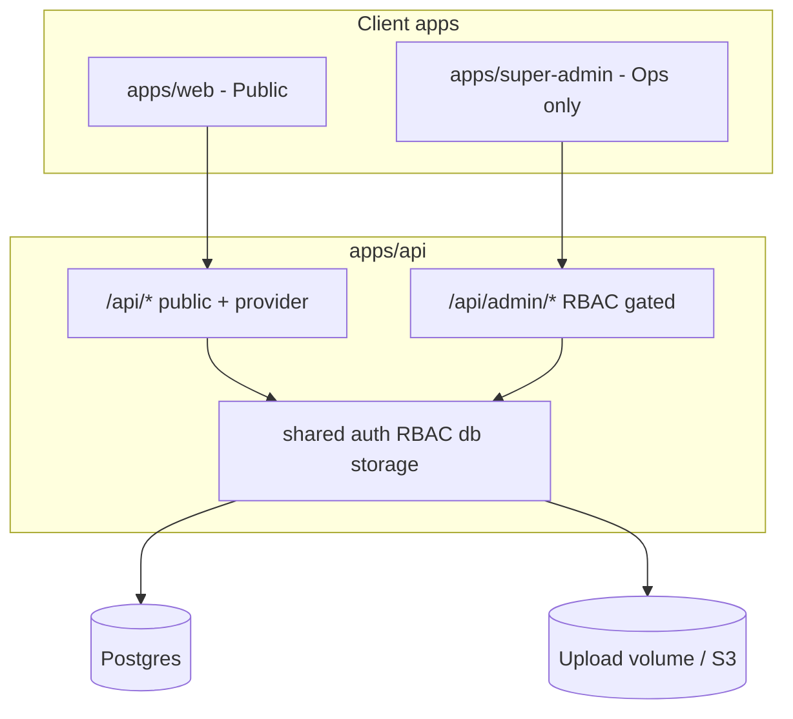

# Super Admin (Separate App) + RBAC + Category Schemas + Assets

## Goal

Harden Concierge for production ops by:

1. **Isolating Super Admin** in its own frontend project (security boundary).
2. Replacing coarse `user | business | admin` checks with **RBAC** (roles, permissions, resource scopes).
3. Letting Super Admin **manage categories** and **define fields per category**.
4. Storing **all files in `Asset` / `Attachment` tables** (no long-term URL arrays on domain rows).

This builds on the existing modular API ([`apps/api`](apps/api)) and the feature inventory in the companion canvas. Public web ([`apps/web`](apps/web)) stays consumer-facing.

**Defaults locked for this plan:**
- One shared API process (modular monolith); Super Admin is a **separate SPA**, not a separate backend (unless volume later demands `/admin` service split).
- Super Admin served on a **distinct origin/port** (e.g. `:8081` / `admin.localhost`) with tighter CORS allowlist.
- RBAC tables coexist with current `Role` enum during migration; enum remains a “primary role” shortcut until phase complete.
- Provider portal stays inside `apps/web` initially (`/list-business`, owner flows); optional `apps/provider` extract is **phase 6 / later**.
- Assets: keep current `StoragePort` + local volume; S3 adapter later without schema change.



---

## Current gap (audit)

| Area | Today | Target |
|------|--------|--------|
| Admin UI | Embedded `/admin` in `apps/web` | Separate `apps/super-admin` |
| AuthZ | `Role` enum + `requireRole(admin)` | Permissions + scopes + tests |
| Categories | Static tree CRUD read; limited admin write | Full tree + field schema CMS |
| Listing fields | Fixed Prisma columns | Dynamic `CategoryField` → values |
| Media | `logoUrl`, `coverUrl`, `images[]`, KYC URL columns | `Asset` + `Attachment` relations |

---

## Phase 0 — Foundation & decisions (design only, short)

**Deliverables (docs/ADR in plan; no heavy code):**

- Confirm Super Admin package name: `apps/super-admin`
- Cookie strategy:
  - **Preferred:** separate cookie name + path for admin sessions (`concierge_admin_session`) OR SameSite + distinct subdomain so public JWT cannot call admin UI accidentally.
  - Step-up / MFA flag on Super Admin accounts (schema field now; provider later).
- Permission catalog draft (stable string keys), e.g.:
  - `users.read`, `users.write`, `businesses.read`, `businesses.moderate`, `businesses.delete`
  - `verification.review`, `reviews.moderate`
  - `categories.write`, `category_fields.write`
  - `assets.read_private`, `roles.manage`, `audit.read`, `settings.write`
- Role presets: Super Admin (all), Moderator, Support Agent, Category Manager (and map existing `admin` → Super Admin, `business` → Service Provider, `user` → User).

**Exit:** Team agrees on permission keys + cookie/CORS approach before schema land.

---

## Phase 1 — RBAC data model & API enforcement

### Schema

```
Permission     id, key (unique), description
RoleDef        id, key (unique), name, isSystem  // optional rename of enum later
RolePermission roleId, permissionId
UserRole       userId, roleId, assignedAt, assignedBy
BusinessMembership  userId, businessId, memberRole (owner|staff), permissions?  // P1 optional
```

Keep Prisma `enum Role` temporarily for backward compatibility; seed maps:
- `admin` users get `super_admin` RoleDef + all permissions
- `business` → `service_provider`
- `user` → `consumer`

### API / shared kernel

- Extend [`shared/auth`](apps/api/src/shared/auth): `requirePermission(...keys)`, `requireAnyPermission`, optional scope helper `assertBusinessAccess(user, businessId)`.
- Mount admin routes unchanged path `/api/admin/*` but switch guards from `requireRole(admin)` → permissions.
- Audit log every role/permission change and every moderate/delete action (reuse `AuditLog`).

### Tests

Authz matrix (anonymous / user / provider / moderator / super_admin) on representative endpoints.

**Exit:** Existing admin APIs work via permissions; non-privileged roles get 403; seed creates permission catalog.

---

## Phase 2 — Asset & Attachment tables

### Schema

```
Asset
  id, storageKey, mimeType, byteSize, checksum?,
  visibility (public|private), status (pending|ready|rejected|deleted),
  uploadedById, createdAt, updatedAt

AssetVariant
  id, assetId, kind (thumb|webp|preview), storageKey, width?, height?

Attachment
  id, assetId,
  entityType (user|business|listing|service|verification|review|message|field_value),
  entityId, purpose (avatar|logo|cover|gallery|kyc_owner|kyc_location|kyc_storefront|
                     kyc_document|kyc_selfie|kyc_video|review_photo|message_file|field),
  sortOrder, createdAt
  @@unique([entityType, entityId, purpose, assetId]) // or allow gallery multiples without unique
```

### Migration strategy (non-breaking)

1. Add tables + wire uploads module to create `Asset` then `Attachment`.
2. **Dual-write:** continue populating legacy URL columns from primary attachment for one release.
3. Backfill script: existing URLs → Asset rows + Attachments.
4. Read path prefers Attachments; fall back to URL columns.
5. Later phase: drop `images[]`, `logoUrl`, `coverUrl`, KYC `*Url` columns.

### Modules

- Expand [`modules/uploads`](apps/api/src/modules/uploads) → create Asset records.
- Add `modules/assets` (resolve signed URLs for private; public CDN/path for public).
- Update businesses, services, verification services to attach via relations.

**Exit:** New uploads only through Asset pipeline; KYC private assets require `assets.read_private` or owner.

---

## Phase 3 — Category field schemas

### Schema

```
CategoryField
  id, categoryId, key, label, helpText?,
  fieldType (text|textarea|number|boolean|select|multiselect|date|url|phone|email|json|asset_ref|asset_gallery),
  required, options Json?, validation Json?,
  scope (listing|service|business),
  sortOrder, section?, isFilterable, isSearchable,
  isActive, schemaVersion Int @default(1)

ListingFieldValue
  id, listingId, fieldId,
  valueText?, valueNumber?, valueBool?, valueJson?,
  // media via Attachment entityType=field_value

ServiceFieldValue  (same shape, serviceId)
```

### Behavior

- Super Admin CRUD on fields for a category; **publish** model: editing draft vs `isActive` published set (MVP: soft `isActive` flag is enough).
- Provider onboarding + listing edit: `GET /api/categories/:id/fields` returns schema; submit values with listing create/update.
- Public business detail: include field values grouped by section.
- Validation: server validates submitted values against CategoryField definitions (Zod built dynamically).

### APIs (sketch)

| Method | Path | Permission |
|--------|------|------------|
| GET | `/api/categories/:id/fields` | public (active only) |
| GET/POST/PATCH/DELETE | `/api/admin/categories...` | `categories.write` |
| GET/POST/PATCH/DELETE | `/api/admin/categories/:id/fields` | `category_fields.write` |

**Exit:** At least one category (e.g. Contractors) has custom fields end-to-end: admin defines → provider fills → public renders.

---

## Phase 4 — Super Admin separate project

### Scaffold

```
apps/super-admin/          # Vite + React + TS (reuse design tokens sparingly; ops UI can be denser)
  src/pages/               # Login, Dashboard, Businesses, Users, Categories, Fields, KYC, Assets, Audit, Roles
  Dockerfile + nginx       # proxies /api → api:3001
```

### Compose / env

- Add `super-admin` service, e.g. host port `8081`.
- `CORS_ORIGIN` includes admin origin.
- `ADMIN_APP_ORIGIN` env for CSRF/cookie checks.
- Remove or redirect `apps/web` `/admin` route to external admin URL (dev convenience link only).

### Security checklist for this phase

- Admin SPA never bundled into public web build.
- Login restricted to users with Super Admin (or staff) RoleDef — not `business`/`user`.
- Rate-limit admin auth harder; optional IP allowlist env.
- No public registration on Super Admin app.

**Exit:** `docker compose up` serves public `:8080` and admin `:8081`; admin login works; public `/admin` gone or redirect-only.

---

## Phase 5 — Super Admin feature build-out

Port and expand beyond current [`Admin.tsx`](apps/web/src/pages/Admin.tsx):

| Section | Features | Priority |
|---------|----------|----------|
| Dashboard | KPI counters (pending KYC, suspended, new listings) | P1 |
| Businesses | List/filter/suspend/activate/edit/feature | P0 |
| Verification | Queue + private asset viewer | P0 |
| Users | Search, disable, role assignment | P0 |
| Categories | Tree CRUD, reorder, archive | P0 |
| Field builder | Drag/sort fields, types, validation, preview | P0 |
| Assets | Browse by entity, visibility, orphan cleanup trigger | P1 |
| Moderation | Flagged reviews | P1 |
| Roles | Assign RoleDefs / view permissions (no free-form perm editing in MVP) | P0 |
| Audit | Filter by actor/entity/date | P1 |
| Settings | Feature flags already in env — read-only display first | P2 |

**Exit:** Ops can run directory without using public web; category + field CMS usable.

---

## Phase 6 — Provider alignment (and optional split)

- Listing create/edit in web uses category schema + Asset uploads.
- KYC wizard writes Attachments only.
- Optional later: extract `apps/provider` if provider UX diverges heavily.
- Introduce `BusinessMembership` when multi-user businesses are required.

---

## Suggested delivery order

1. **Phase 0** decisions (½ day)
2. **Phase 1** RBAC (foundation for everything admin)
3. **Phase 2** Assets (unblocks clean KYC + media)
4. **Phase 3** Category fields (CMS value)
5. **Phase 4** Super Admin app shell + auth isolation
6. **Phase 5** Admin feature pages
7. **Phase 6** Provider consumption + cleanup legacy columns

Do **not** start the Super Admin UI (phase 4–5) before RBAC + assets are at least dual-write ready — otherwise the new app inherits the same URL-column debt.

---

## Explicit non-goals (this plan)

- Separate admin microservice / separate database
- Full MFA provider integration (schema + UI hook only until Twilio/etc. ready)
- Elasticsearch, real-time chat, payments product work
- Immediate drop of `Role` enum (migrate after Super Admin is stable)
- Building `apps/provider` in the first ship

---

## Success criteria

- Super Admin runs as its own deployable app; public SPA contains no privileged admin screens.
- Privileged API actions require explicit permissions; authz tests cover deny paths.
- Categories can define required/optional fields; providers submit values; public pages display them.
- New uploads create `Asset` + `Attachment` rows; private KYC never exposed on public APIs.
- Docker Compose still one-command local run (now with public + admin frontends).
- Modular API boundaries preserved (`modules/admin`, `modules/assets`, `modules/categories` extensions).

---

## Risk notes

| Risk | Mitigation |
|------|------------|
| Cookie collision between web & admin on localhost | Distinct cookie names + paths; separate ports in Compose |
| Large migration of image URL arrays | Dual-write + backfill job; feature flag `ASSETS_READ_PRIMARY` |
| Over-flexible field builder delays MVP | Ship 6–8 field types first; defer conditional logic |
| Staff roles unused initially | Seed Moderator + Category Manager even if UI assign-only |

---

## Immediate next step after plan approval

Implement **Phase 1** (RBAC schema + `requirePermission` + seed + tests), then Phase 2 Asset tables—before scaffolding `apps/super-admin`.
