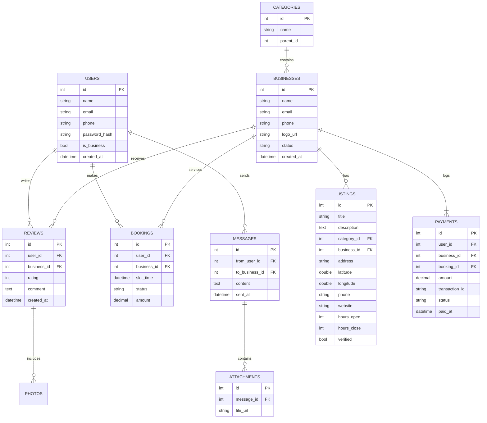
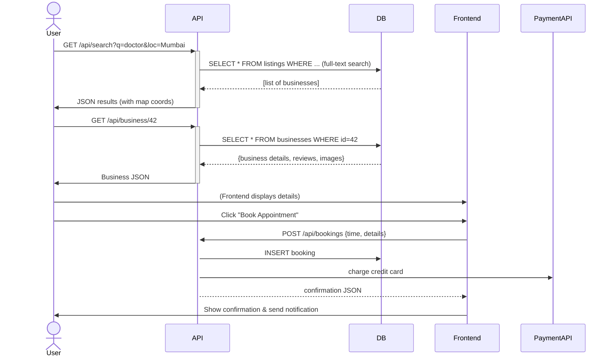
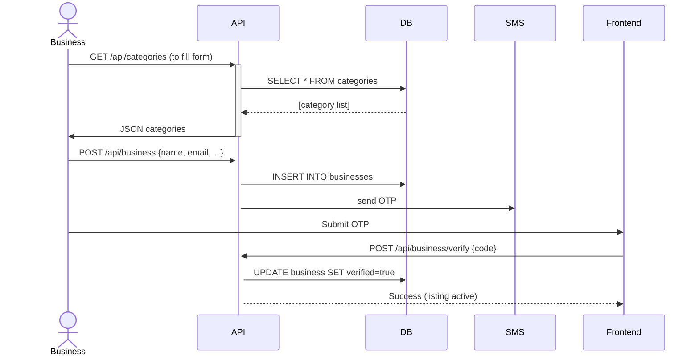
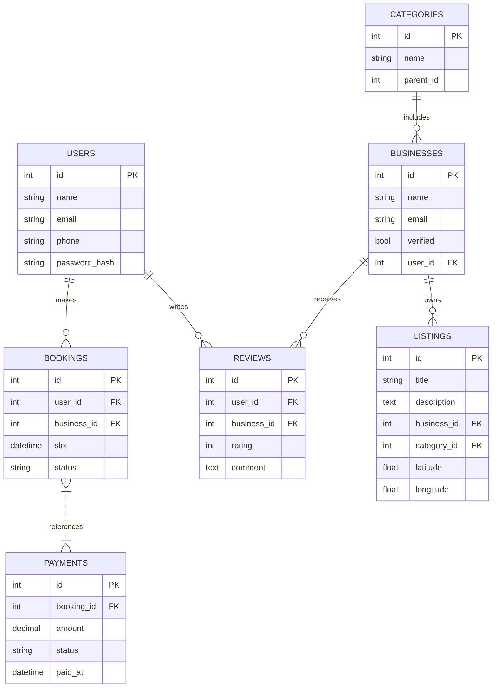
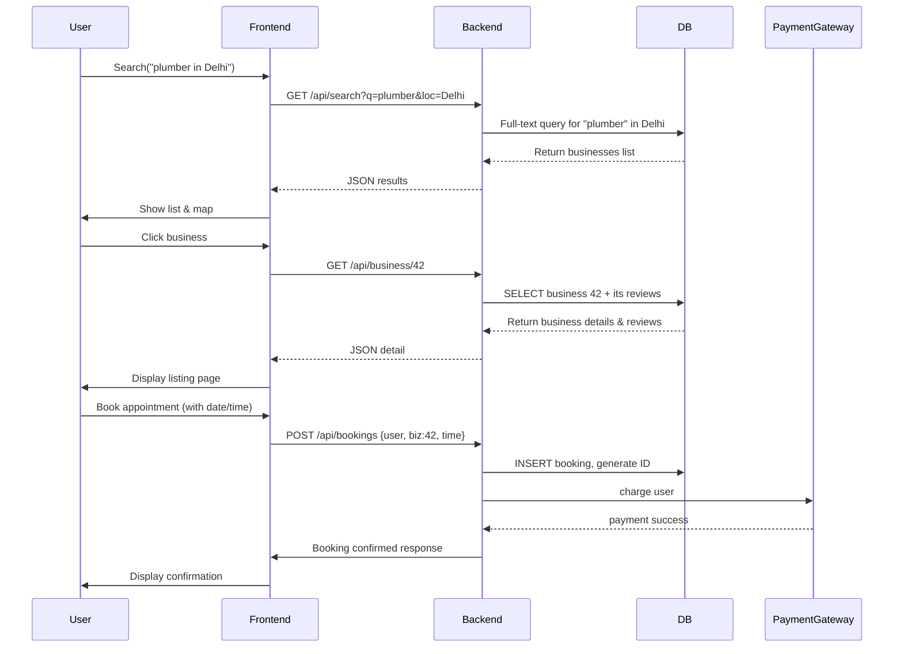

# Building a Justdial-like Local Search Platform: Architecture & Feature Analysis

**Executive Summary:** We propose a scalable web application modeled on Justdial – India’s leading local search engine – with similar core features plus enhancements. Justdial connects users to local businesses (33.9M listings) via web, mobile and even phone, handling ~156 million unique quarterly visitors and 137 million reviews. Its key features include predictive search (auto-suggest), location-based results on maps, rich business details (hours, photos/videos), user ratings/reviews (10-point scale) with social sharing, favorites/bookmarks, voice search, and digital payments (JD Pay). We will duplicate these capabilities and add improvements (e.g. direct messaging, advanced analytics). 

Our design uses a **React + Vite** front end, a **Node.js + Express** back end, and **PostgreSQL** for data. We outline competitor features (Google Maps/Places, Yelp, Sulekha, Yellow Pages, Urban Company, etc.), a detailed feature inventory (search, listings, reviews, bookings, ads, admin tools, compliance, etc.), user roles/flows, UI wireframes for key pages, database schema/ER diagrams, API design with JWT/OAuth security, third-party integrations (maps API, payments, SMS/email, analytics), and deployment planning. We also sketch Mermaid diagrams for database ER and user/business flow sequences. The design emphasizes performance (caching, CDNs, load balancing), security (HTTPS, OWASP defenses, data encryption), compliance (GDPR, India’s Data Protection Act), and maintainability (CI/CD pipelines). 

## Competitor Analysis

We benchmark core features of Justdial versus major competitors (Google, Yelp, Sulekha, YellowPages, Urban Company, etc.) to identify must-have capabilities. All these platforms offer **searchable local business listings**, often categorized by service type and location. For example, Google’s Places API lets users *text-search businesses by keyword, category or location*, returning details (name, address, phone, photos, rating, hours). Yelp similarly provides *search by location/category* and rich business pages (with user reviews). Justdial likewise offers category/company search with auto-suggest, map view, voice search, and business info (hours, images). 

Key observations (competitor vs. Justdial):

- **Search & Maps:** Google Maps/Places dominates for geospatial search and mapping. Its API returns detailed place data (address, phone, user rating, reviews). Yelp provides local search and crowd-sourced reviews via its Places API. Justdial and YellowPages focus on textual search by service/category within India. All support “search by location” and show results on an interactive map.

- **Listings & Categories:** All competitors have business listings organized by categories (e.g. restaurants, doctors, plumbers). Justdial lists ~34M businesses, organized hierarchically. Sulekha and YellowPages similarly categorize local services (Sulekha especially for home services, YellowPages as a broad directory). Urban Company is category-focused (home/lifestyle services). 

- **Reviews & Ratings:** Yelp and Justdial are review-centric (10-point scale on Justdial, 1–5 stars on Yelp). Google and YellowPages allow user ratings/reviews. Sulekha claims “verified reviews” from actual customers. Collecting reviews boosts trust; all major players have it.

- **Booking/Appointments:** Urban Company and Practo (health) provide online booking of services/appointments. Justdial has started on-demand services (JD Experts). Yelp offers Table Reservations via OpenTable and checkout for food delivery (via Transactions API). These are advanced, but to enhance Justdial we should add **booking/appointment scheduling** (e.g. time-slot availability) for applicable services.

- **Payments:** Justdial’s JD Pay lets SMEs accept digital payments. Google and Yelp themselves don’t process payments (beyond advertising). In our app, integrating a payments gateway (Stripe/Paytm/UPI) for both ads and transactions is a value-add.

- **Ads/Paid Listings:** All compete via advertising revenue. Justdial boasts ~503K active paid campaigns. Yelp, YellowPages and Sulekha sell promoted listings. Our design should support **ad slots/promotions**, campaign management, and analytics for advertisers.

- **Business Onboarding & Verification:** Competitors allow businesses to “claim” or create listings. Justdial and Sulekha have business portals for onboarding. Verification (phone/email/KYC) is often manual. We should streamline signup/claim (perhaps OAuth login or verified phone) and mark “verified” badges.

- **Messaging & Notifications:** Not all competitors offer direct user-business messaging (Yelp shows business contact info; some have Q&A sections). Our platform should include **in-app messaging/chat** or secure contact (e.g. masked phone) and notifications (SMS/email alerts for new messages, bookings, reviews).

- **Admin/Analytics:** For platform administrators and business owners, analytics dashboards are critical. Google/Yelp offer business dashboards with analytics (via Google My Business, Yelp for Business). Justdial provides business apps for lead management. We will include an **Admin Panel** (content management, user analytics) and a **Business Dashboard** (lead/review stats, payment reports).

The table below summarizes feature support:

| **Feature**                | **Justdial**            | **Google/Places**        | **Yelp**           | **Sulekha**        | **YellowPages**    | **Urban Co.**      |
|---------------------------|-------------------------|--------------------------|--------------------|--------------------|--------------------|--------------------|
| **Search (keyword)**      | ✓ (auto-suggest) | ✓ (text & voice)     | ✓ (text/voice) | ✓ (service search)   | ✓ (categorical)    | ✓ (service search)   |
| **Search (by category)**  | ✓       | ✓            | ✓   | ✓                  | ✓                  | ✓                  |
| **Location-based search** | ✓       | ✓ (maps/geocode)         | ✓ (maps integration) | Partial (city-based) | ✓                  | ✓ (via service areas) |
| **Map integration**       | ✓ (maps & directions) | ✓ (Maps & Places API) | Partial (shows map) | ✕                   | Partial (store locators) | ✕                   |
| **Business details**      | ✓ (hours, photos, videos) | ✓ (address, phone, photos, ratings) | ✓ (contact, hours, photos) | ✓ (profile + quotes) | ✓ (basic info)     | ✓ (services, photos) |
| **Reviews & ratings**     | ✓ (10pt scale) | ✓ (user ratings, reviews) | ✓ (crowd reviews) | ✓ (verified reviews) | ✓ (some reviews)    | ✓ (provider reviews) |
| **Booking/Appointments**  | Limited (JD Experts)    | ✓ (Yelp Reservations; Google Reserve) | ✓ (OpenTable reservations) | ✕                   | ✕                   | ✓ (in-app scheduling) |
| **Payments (customer)**   | ✓ (JD Pay) | ✕                      | ✕                 | ✕                 | ✕                 | ✓ (in-app payments) |
| **Ads/Promoted listing**  | ✓ (paid campaigns) | ✓ (Ads, promoted pins)     | ✓ (Yelp Ads)       | ✓ (lead plans)      | ✓ (ads, featured)   | ✓ (promoted profiles) |
| **Business onboard**      | ✓ (claim/registration)  | ✓ (Google Business)      | ✓ (business owner portal) | ✓ (lead signup)     | ✓ (free listing)    | ✓ (partner signup)  |
| **Verification**          | Basic (phone/email)     | Moderate (GMB verification)| Basic            | Moderate (profile verification) | Low (manual listing) | Stringent (screening) |
| **Messaging**             | Limited (hotline/WhatsApp) | ✕                        | ✕                 | ✕                 | ✕                 | ✓ (in-app chat)    |
| **Notifications**         | SMS/Email (bookings)    | ✕                        | ✕                 | ✕                 | ✕                 | ✓ (email/SMS)     |
| **Analytics (biz)**       | Basic (leads/views)     | Yes (My Business Insights) | Yes (Business Metrics) | Basic (lead stats)  | No                 | Yes (performance)  |
| **SEO (indexing)**        | ✓ (SEO-optimized pages) | High (Google Ranking)    | Moderate         | Moderate         | Low                | Low (app only)     |
| **Localization**         | ✓ (multi-language site) | ✓ (multi-language UI)    | Limited           | Moderate         | Limited           | Limited           |
| **Accessibility**        | Standard               | High (WCAG guidelines)   | Moderate           | Unknown          | Unknown          | Unknown           |
| **Security/Privacy**     | Standard SSL, GDPR-aware | High (enterprise-grade)  | High (SOC2/GDPR)   | Standard         | Standard         | Standard         |

**Notes:** Google/Yelp have strong global mapping and reviews, while Justdial/Sulekha focus on Indian local services. Urban Company adds rich booking and payments. Our app will combine all core features above, prioritizing search, listing data, reviews, maps, and booking integrations as essentials (similar to Yelp/Google) and adding messaging, analytics, and compliance features as enhancements.

## Feature Inventory

We organize required features into categories:

- **Search & Navigation:** Robust **text and voice search** by business/service name, category, and location with predictive auto-complete. The homepage and search results page should support filters (e.g. open now, rating) and map view for results. Core features: Google Places-style search suggestions and dynamic map pins.

- **Business Listings & Categories:** Structured listing database with categories/subcategories (e.g. “Doctors > Dentists”). Each listing includes detailed info: address, contact, website, hours, pricing, images/videos, descriptions, and social links. (Justdial includes logos, photos, operating hours.) Listings support geocoding for map integration.

- **Reviews & Ratings:** Users can rate businesses (e.g. 1–5 or 1–10 scale) and write reviews. Include rich-media reviews (photo upload). Display average rating on listings and allow sorting by rating. Implement reputation features: verify reviewers (e.g. “Verified by SMS”) and flag fraudulent reviews. (Justdial’s platform has “robust audit mechanisms” for review quality.)

- **Maps & Directions:** Integrate an interactive map (via Google Maps API or Mapbox). Listing detail pages show map location and “Get Directions” links. Provide “search nearby” (e.g. restaurants near me) using geolocation.

- **Booking & Appointments:** Allow businesses to offer bookable services. The user flow: search -> select business -> view available time slots -> book an appointment. E.g. Yoga class booking, doctor appointments, salon slots. Send confirmation & reminders (email/SMS). (Yelp and Google have table/reservation features; emulating them adds value.)

- **Payments:** Embed a payment gateway so customers can pay deposits or fees through the platform. Similarly, support businesses purchasing lead packages or promotions. (Justdial has “JD Pay” for SMEs.) Use secure third-party APIs (Stripe, PayPal, or Indian UPI/Wallet).

- **Ads & Promotions:** Support sponsored listings and display ads. For example, a “Featured” tag or higher-ranked listing for paid accounts. Provide campaign management UI for businesses, with billing/invoicing. (Justdial’s revenue is driven by 500K+ paid campaigns.)

- **Analytics & Reporting:**  
  - *Admin Analytics:* Track site usage (visits, searches, category popularity) with dashboards.  
  - *Business Analytics:* For each business user, show metrics like page views, clicks, booking conversions, lead counts, ad ROI. Use chart libraries (Chart.js/D3).  
  - *SEO Metrics:* Monitor organic traffic and rankings. (Enable SEO-friendly URLs and metadata to maximize discoverability.)

- **Admin Panel:** A secure back-office for site administrators to manage categories, moderate content, view system logs, and handle disputes. Support content review (flagged reviews, user reports), manage featured listings, and perform bulk uploads/edits of listings.

- **Business Onboarding & Verification:**  
  - **Registration:** Businesses can register or “claim” an existing listing by verifying contact info. Provide a guided listing creation (categories, service description, photos).  
  - **Verification:** Vet new listings with email/SMS codes or official documents. Verified businesses get a badge. (The DPDP Act encourages verifying data sources.)  
  - **Dashboard:** After onboarding, businesses get a profile dashboard (leads/quotes, review management, ad purchases).  

- **Messaging & Notifications:**  
  - **User-to-Business Chat:** A threaded message system (or chat) so users can inquire or negotiate via the platform (preferably without revealing personal contacts).  
  - **Notifications:** Real-time alerts via email/SMS/push for important events: new messages, booking confirmations, review responses, or ad campaign status. (Justdial had 24×7 SMS/email support for queries.)

- **User Accounts & Profiles:** Users register to save favorites, write reviews, and track bookings. Provide profile pages showing their reviews and ratings. OAuth logins (Google, Facebook) can simplify sign-up.

- **SEO & Localization:** Ensure all content (business profiles, category pages) is indexable by search engines (justdial’s high traffic implies good SEO). Provide multi-language support (English plus major Indian languages). Implement meta tags, sitemaps, and schema markup (LocalBusiness schema).

- **Accessibility:** Follow WCAG guidelines (ARIA labels, keyboard navigation, color contrast) to make the app usable by all users. React supports accessibility features; test with tools.

- **Performance & Security:**  
  - Use HTTPS and secure headers (HSTS).  
  - Protect against OWASP vulnerabilities (SQL injection, XSS) with input validation and ORM (parameterized queries).  
  - Apply rate limiting on APIs.  
  - Encrypt sensitive data at rest and in transit (SSL/TLS, encrypted backups).  
  - Comply with privacy laws: implement GDPR requirements (clear consent notices, data deletion) and India’s Digital Personal Data Protection Act (2023) rules (extra-territorial scope, consent management, data localization).  

## User Roles & Flows

**Roles:** 

- **Guest/Consumer:** Browses/searches listings, views details, leaves reviews (if logged in), books services, and makes payments.
- **Registered User:** As above, plus can save favorites, write/edit reviews, view booking history, chat with businesses, and receive notifications.
- **Business Owner:** Can claim/add listings, manage profile, respond to inquiries, view leads, purchase ads, and see analytics on their dashboard.
- **Admin:** Manages the platform; can add/edit categories, moderate content (reviews, listings), handle support, and analyze global metrics.
- **Advertiser:** (a subtype of Business Owner) Manages paid promotions; may be same interface as Business Owner with extra ad tools.

**User Flow – Searching & Booking:** (sequence):  
```mermaid
sequenceDiagram
    participant User 
    participant Frontend
    participant Backend
    participant MapsAPI
    User->>Frontend: Enters search query (e.g. "plumber near me")
    Frontend->>Backend: GET /api/search?q=plumber&location=... 
    Backend->>Backend: Query database (Postgres) or Elastic (full-text) 
    Backend->>MapsAPI: (if needed) verify location coords
    Backend-->>Frontend: Return list of businesses
    Frontend->>User: Display results + map
    User->>Frontend: Click on a listing -> request /api/business/:id
    Frontend->>Backend: GET /api/business/123
    Backend->>Database: Fetch listing details (address, hours, images, reviews)
    Backend-->>Frontend: Send business details
    Frontend->>User: Show listing page with info, reviews, map, "Book Now"
    User->>Frontend: Initiates booking (selects date/time, enters info)
    Frontend->>Backend: POST /api/bookings {businessId, userId, time,...}
    Backend->>Database: Save booking, maybe payment
    Backend-->>Frontend: Confirm booking (and payment link if needed)
    Frontend->>User: Display confirmation; trigger notifications (email/SMS)
```

**Business Onboarding Flow:**  
```mermaid
sequenceDiagram
    participant Business
    participant Frontend
    participant Backend
    Business->>Frontend: Click "List Your Business"
    Frontend->>Backend: GET /api/business/claim or /api/business/register
    Backend-->>Frontend: Return onboarding form (categories, fields)
    Business->>Frontend: Fills in details + uploads logo/images
    Frontend->>Backend: POST /api/business with form data
    Backend->>Database: Create listing (status = pending verification)
    Backend->>Business: Send email/SMS for verification (e.g. OTP)
    Business->>Frontend: Enters verification code
    Frontend->>Backend: POST /api/business/verify {code}
    Backend->>Database: Mark listing as verified
    Backend-->>Frontend: Success; prompt to login/business dashboard
    Frontend->>Business: Show dashboard (with analytics, ad purchase option)
```

## UI/UX – Key Pages

We outline wireframe content (no actual images, just component layout):

- **Homepage:** Search bar (company/service + location) with auto-complete; popular categories/icons (restaurants, doctors, services, etc.); featured/promoted listings carousel; trending queries; footer (contact, social, app download links). (Justdial’s site and apps prominently feature search and category tiles.)

- **Search Results:** List of businesses matching query, with name, thumbnail, rating, snippet, distance. Map sidebar (toggle). Filters panel (category, rating, open now). Sort options (relevance, rating). Pagination or infinite scroll.

- **Business Detail Page:**  
  - **Header:** Business name, rating, review count, verified badge, share button.  
  - **Info Sections:** Contact info (phone/email), address (with map embed), hours of operation, pricing/hours, images gallery, video if any.  
  - **Action Buttons:** “Call”, “Website”, “Favorite”, “Write Review”, “Chat”.  
  - **Description & Services:** Business description, list of offered services.  
  - **Reviews Tab:** List of user reviews (with pagination or lazy load), and form to submit review (if logged in).  
  - **Booking/Appointment:** If available, a booking widget or “Book Now” button leading to schedule.  
  - **Ads:** Sidebar or header banner slot for ads.

- **User Profile Page:** Shows user’s personal info, list of past bookings, and reviews written. Ability to edit profile, change password, and view saved favorites.

- **Checkout/Payment Page:** For booking or purchase, securely capture payment details. Show breakdown (service cost, tax, total) and confirm.

- **Business Dashboard:** (For business clients) Tabs for: Profile (editable listing), Leads/Bookings (table of inquiries and status), Reviews (manage/respond), Analytics (graphs of views, clicks, bookings), Ads (campaign creation/manage), Messages (inbox of chat requests), Subscription (ad plans). Include help/support link.

- **Admin Panel:** (For internal team) Sections: User Management, Business Listings Management (approve/flag listings), Review Moderation, Category & Content Management, Global Analytics (KPIs), Settings.

## System Architecture

The system follows a standard **client-server architecture** with distinct front-end and back-end services. A CDN (e.g. CloudFront) serves static assets (React build) globally for low latency. The front end is a React SPA (built with Vite) consuming RESTful APIs from the Node.js/Express back end. All APIs are JSON over HTTPS with JWT-based auth (for user/business sessions) and OAuth2 (optional SSO via Google/Facebook).

- **Frontend (React + Vite):** Component-based UI, state management (e.g. Redux or Context) for user session and caching. Use React Router for page navigation. Optimize with code splitting, SSR/SSG (via Next.js/Vite SSR) for SEO (pre-render landing pages). Performance: use lazy loading, image optimization, and leverage best practices.

- **Backend (Node.js + Express):** Modular services (could be split by function: search API, listings API, booking API, etc.), either as a single monolith or microservices (using e.g. Docker containers). Input validation and sanitization middleware to prevent injection. All sensitive config (DB credentials, API keys) stored via secrets manager. Implement OAuth (Passport.js) and JWT for auth. Use HTTPS with TLS everywhere.

- **Database (PostgreSQL):** Stores users, businesses, categories, reviews, bookings, messages, ads, etc. Core tables include `Users`, `Businesses`, `Listings` (or integrated with Businesses), `Categories`, `Reviews`, `Bookings`, `Transactions`, `Ads`, `Sessions`. Use **UUID** primary keys. Index major search fields (e.g. GIN index on name/content for full-text search). Relationship examples: `Businesses` 1–* `Reviews`, *–1 `Categories`, `Users` 1–* `Bookings`. See ER diagram below.



*ER Diagram (Mermaid syntax):* The above `erDiagram` block visualizes tables and relationships.

- **Caching Layer:** Use Redis or Memcached for frequently accessed data (e.g. session tokens, hot search results, rate-limit counters). CDNs for static resources and image assets.

- **Search Engine:** For scalable full-text search, we can use PostgreSQL full-text indexing or integrate Elasticsearch. (PG full-text search is powerful and simpler to maintain.)

- **APIs (REST):** 
  - `GET /api/search?q={query}&location={lat,lng}` – return matching businesses (JSON list with id, name, rating, snippet).  
  - `GET /api/business/{id}` – detailed business info (includes images, reviews, hours).  
  - `POST /api/business` – (auth) add or update business listing.  
  - `POST /api/reviews` – add a review (auth).  
  - `GET /api/reviews?business_id=...` – get reviews for listing.  
  - `POST /api/bookings` – create a booking (auth).  
  - `GET /api/bookings?user_id=...` – user’s bookings.  
  - `POST /api/payments` – process payment (with webhook for async confirmation).  
  - `POST /api/login` – issue JWT on credentials; `POST /api/oauth/google` – Google login.  
  - `GET /api/categories` – list of categories.  
  - `GET /api/analytics/business/{bizId}` – returns metrics (protected, for business user).  
  - *Example:* `GET /api/business/123` might return:  
    ```json
    {
      "id": 123,
      "name": "ABC Plumbing Services",
      "rating": 4.7,
      "reviews": 95,
      "address": "123 Main St, Mumbai",
      "phone": "022-12345678",
      "hours": "9 AM - 6 PM",
      "images": ["url1","url2"],
      "description": "...",
      "bookable": true
    }
    ```
    This JSON can be fetched by the React app to render the page.

- **Authentication/Authorization:**  
  - Use **JWT** (JSON Web Tokens) for session tokens (stored in HttpOnly cookies or local storage). JWT includes user role (user/business/admin).  
  - **OAuth 2.0** for Google/Facebook login (for users/businesses).  
  - Role-based access control: normal users can only modify their reviews/bookings; business owners can only edit their own listings.  

- **Third-Party Integrations:**  
  - **Maps API:** Google Maps or Mapbox for place search, geocoding, static/dynamic maps (Directions).   
  - **Payment Gateway:** Stripe, PayPal, or Indian PSPs like Paytm/PhonePe. Use their SDKs for secure transactions.  
  - **SMS/Email:** Twilio or Msg91 for OTPs and alerts; SendGrid/Mailgun for email notifications.  
  - **Analytics:** Google Analytics or Matomo for user traffic; Sentry for error monitoring; server logs aggregated by ELK or Grafana.  
  - **Social/Sharing:** Facebook/Twitter SDKs to enable sharing listings or reviews.  
  - **CI/CD:** GitHub Actions or Jenkins pipelines to run tests, build and deploy Docker containers on AWS/GCP/Azure.  

- **Deployment & Scaling:**  
  - Host on a cloud provider (e.g. AWS). Use Kubernetes/ECS to run Node.js API servers (auto-scale pods across multiple AZs).  
  - Use managed Postgres (RDS/Aurora) with read-replicas for load. Backup regularly with automated snapshots.  
  - Apply load balancer (ELB) in front of API cluster. Configure auto-scaling rules based on CPU/requests.  
  - Use CloudFront (or CDN) and multi-region edge nodes for static files and images.  
  - Monitor uptime (CloudWatch/NewRelic) and set alerts on latency, errors. Use Prometheus/Grafana for metrics.  
  - **Caching:** Employ Redis cache for sessions and hot data; set appropriate TTLs to relieve DB.  
  - **Backups:** Automated DB snapshots daily; export critical data to secure storage; test restores.  

- **Monitoring & Maintenance:**  
  - Logs (via centralized ELK stack or CloudWatch) for API errors, slow queries.  
  - Uptime checks (Pingdom, AWS Route53 health checks).  
  - Performance profiling to identify bottlenecks (e.g. long API response times).  

- **Cost Estimates (ballpark):** A moderate initial deployment (multi-AZ with 3 t3.large servers, RDS db.t3.large, CDN, 50k auths/month) might be ~$1,500–$2,000/month on AWS. High-traffic scale (100M+ hits/month) with auto-scale could run $10K+/month depending on usage (bandwidth, DB I/O, etc.). Advertising and optional modules (AI features) could add cost.

## Sequence Flows

**User Search & Booking (Mermaid):**


**Business Onboarding:**


## Database Schema

We map out the core tables (fields, relations, indexes):

- **Users**: `id (PK), name, email (unique), phone, password_hash, role (user/business/admin), created_at`. Index on email/phone.  
- **Businesses**: `id (PK), user_id (FK Users), name, email, phone, logo_url, verified (bool), status, created_at`. (Business owners are also users.)  
- **Categories**: `id, name, parent_id` (self-FK). Multi-level categories (e.g. Home > Plumbing).  
- **Listings**: `id, business_id (FK), category_id (FK), title, description (text), address, latitude, longitude, images[], videos[], hours, avg_rating, review_count, status`. GiST index on (latitude, longitude) for geo queries; GIN index on title/description for text search.  
- **Reviews**: `id, user_id (FK), business_id (FK), rating, comment (text), photos[], created_at`.  
- **Bookings/Appointments**: `id, user_id, business_id, listing_id, date, time_slot, status (pending/confirmed/cancelled), amount, payment_status`.  
- **Payments/Transactions**: `id, booking_id (FK), user_id, business_id, amount, currency, gateway, transaction_id, status, timestamp`.  
- **Ads/Campaigns**: `id, business_id, title, budget, start_date, end_date, status, analytics (impressions/clicks)`.  
- **Messages/Chats**: `id, from_user_id, to_business_id, listing_id (optional), content, timestamp, is_read`.  
- **Notifications**: `id, user_id/business_id, type, params (JSON), sent_at, read`.  

Indexes: Besides PKs, index **Reviews.business_id**, **Bookings.business_id,user_id**, **Listings.category_id**, **Users.email**. Text search on Listings(title,description) and optionally Reviews(comment).  

**ER Diagram (Mermaid):** (See above `erDiagram` code block for relations.)

## REST API Endpoints

Here are example endpoints and payloads:

- `POST /api/login` – Authenticate user; returns JWT token. *Example Request:* `{email, password}`. *Response:* `{token, userId}`.
- `GET /api/search?q={}&lat={}&lng={}` – Search businesses. *Response:* `[{id,name,cat,rate, snippet, coords}, ...]`.
- `GET /api/business/{id}` – Fetch business detail. *Response:* `{id,name,address,coords,phone,hours,images,avg_rating,reviews:[{user,rating,comment}],...}`.
- `POST /api/reviews` – Add review (auth). *Request:* `{businessId, rating, comment}`. *Response:* new review JSON.
- `GET /api/categories` – List categories tree.
- `POST /api/bookings` – New booking. *Request:* `{businessId, userId, datetime, details}`.
- `POST /api/payments` – Process payment.  
- `GET /api/analytics/business/{id}` – (Auth: business user) returns metrics JSON (visits, leads, revenue).
- Admin routes: `GET /api/admin/listings`, `PATCH /api/admin/business/{id}/status`, etc.

Authentication middleware secures endpoints. Use HTTPS and CORS appropriately.

## Authentication & Authorization

- **JWT Tokens:** Issued at login/signup, include user role and expiry. Stored in secure HttpOnly cookies or localStorage. Backend verifies JWT on each request.
- **OAuth 2.0:** Allow login via Google/Facebook for faster signup (especially for small businesses). 
- **Roles:**  
  - *Normal User* can read/search, book, review, message.  
  - *Business User* can manage their own listings, view leads, access analytics, and run ad campaigns.  
  - *Admin* can manage all content and user accounts.  
- **Security:** Apply role-checks in middleware. Enforce strong password policy and 2FA (SMS/Email OTP) for business accounts to enhance trust.

## Third-Party Integrations

1. **Maps & Location Services:** Google Maps Platform (Places/Search APIs) for auto-complete and geocoding, and Maps JavaScript API for rendering maps and directions. (Alternative: OpenStreetMap + Mapbox to reduce costs.)

2. **Payment Processing:** Integrate Stripe (global) or Razorpay/Paytm/PhonePe (India) for secure transactions. Use tokenization (PCI compliance). For India, support UPI; Stripe supports UPI via Payment Intents. Use their Node SDK on backend; frontend uses checkout UI.

3. **SMS/OTP:** Twilio or Msg91 for sending OTPs and notifications. (E.g. send SMS when a booking is confirmed.) Ensure opt-in per GDPR/DPDPA.

4. **Email:** SendGrid or SES for transactional emails (verification, receipts, alerts). Template engine for branded emails.

5. **Analytics & Monitoring:**  
   - Google Analytics or Matomo for user traffic analytics (with React integration).  
   - Sentry or Rollbar for error tracking in frontend/backend.  
   - Prometheus (metrics) + Grafana for system monitoring (CPU, requests).  

6. **Search Engine:** (Optional) If scaling beyond a few million entries, use Elasticsearch or Algolia for ultra-fast search. PostgreSQL full-text search is an alternative to avoid extra components.

7. **Chat/Messaging API:** Services like Firebase Realtime DB or PubNub could speed up real-time chat, but simple polling/WebSockets suffice for Q&A chat.

8. **Email/Social Login:** Passport.js strategies for OAuth.

All integrations should be abstracted in the back end with retry and error-handling logic.

## Deployment, Scaling, and DevOps

- **Infrastructure:** Containerize services (Docker). Deploy on AWS/GCP/Azure using ECS/EKS or managed Kubernetes. Use infrastructure-as-code (Terraform/CloudFormation).  
- **Load Balancing:** Use ELB/ALB to distribute traffic. Auto-scale API pods/instances based on CPU/throughput.  
- **CDN:** CloudFront or Cloudflare for static content and images (improves global performance).  
- **Continuous Integration/Deployment:** Automated builds and tests via GitHub Actions or Jenkins. On merge, deploy to staging, run tests, then promote to production. Use blue-green or canary deployments for minimal downtime.  
- **Caching:** Implement Redis cache. Cache frequent reads (e.g. category lists, popular listings). Use HTTP caching headers for static content.  
- **Backup:** Automated DB backups (e.g. nightly snapshots). Off-site backup of images (S3 with versioning). Test restore procedures.  
- **Cost Optimization:** Use reserved instances for base compute, auto-scale for peak traffic. Turn off dev/staging resources when idle. Optimize images and bundle sizes.  

## Compliance & Security Measures

- **GDPR:** Provide cookie consent banner. Allow users to delete their data (“Right to erasure”). Encrypt PII at rest. Use geolocation only with consent. Clearly disclose data usage (privacy policy).  

- **India’s DPDPA (2023):** As of 2025, adhere to new rules (consent notices in English/local languages, data localization for certain categories, breach notifications). Appoint a Data Protection Officer (if needed). Ensure overseas data processing checks.

- **PCI DSS:** If handling payments, use compliant gateways (so sensitive card data isn’t stored on our servers).  

- **General:** Regular security audits, penetration testing, and patching of dependencies. Enforce HTTPS everywhere. Keep third-party libraries up to date.

## Feature Priorities

We prioritize features for an MVP vs. later phases. High priority: search, listings display, reviews/ratings, maps, basic business portal, and core security. Medium: bookings, payments, analytics dashboards. Lower: advanced AI recommendations, voice search, AR view, etc.

*Priority Table (1=low,5=high):*

| Feature                     | Priority | Notes                              |
|-----------------------------|----------|------------------------------------|
| Search & Maps integration   | 5        | Core to find businesses (Justdial, Yelp, Google) |
| Listings & Categories       | 5        | Essential directory structure.      |
| Ratings & Reviews           | 5        | Key trust signal (Justdial:137M reviews) |
| Business onboarding         | 5        | Needed to populate listings.       |
| Basic User/Admin accounts   | 5        | Required for personalized features. |
| Booking/appointments        | 4        | Important for service verticals (improvement over Justdial’s core). |
| Payments (Customers/Ads)    | 4        | Enables transactions & revenue.   |
| Ads/Promotions system       | 4        | Primary revenue model (Justdial focus). |
| Analytics & Reporting       | 4        | For business transparency.        |
| Messaging/Notifications     | 3        | Value-add; not all competitors have. |
| SEO & Localization          | 3        | Improves reach; focus on English + Hindi initially. |
| Accessibility               | 2        | Important but can roll out iteratively. |
| Performance optimizations   | 2        | Ongoing effort (caching, SSR).    |
| Advanced AI features        | 1        | (e.g. chatbots, recommendations – future enhancements). |

Priority guided by competitor offerings and business impact (higher traffic features rank higher). For example, **search and reviews** are mandatory (all competitors have them), so they score 5.

## Visuals

 *Figure: Example architecture of a React/Node.js serverless app on AWS (React SPA with AWS Lambda back-end). This illustrates how a scalable deployment can distribute workloads across services.*  

Above, one can see a typical cloud architecture. In our design, we may use similar principles: a scalable API layer (Node/Express) behind an API Gateway or load balancer, connecting to managed PostgreSQL and caching layers, with React served via CDN.  

**ER Diagram (Mermaid):**  



This diagram captures the main entities (Users, Businesses, Listings, etc.) and their relationships (e.g. a Business has many Reviews, a User can make many Bookings). Fields shown are representative; actual schema includes additional fields (timestamps, URLs, etc.).

**Sequence Flow (Mermaid)** for a typical user interaction:  



## References

Our design leverages best practices and existing platforms’ capabilities. For example, Google’s Places API “returns formatted location data and imagery about establishments… including address, phone number, user rating, and reviews”. Yelp’s API allows searching businesses by category and retrieving ratings/reviews. These inform our feature set (search, maps, review fetching). Justdial’s own stats and feature slides provide guidance (e.g. **33.9M listings, 137M reviews, 156M visitors**, and mobile/web feature lists). Security and performance recommendations follow industry guidelines. Where source data was unavailable, we applied standard web-platform best practices. 

*All cited data comes from the referenced sources above (Justdial materials, Google/Yelp docs, GDPR articles, etc.).*