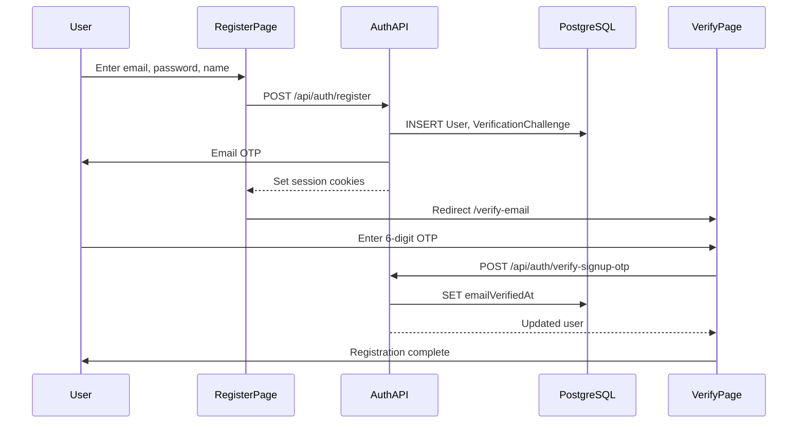
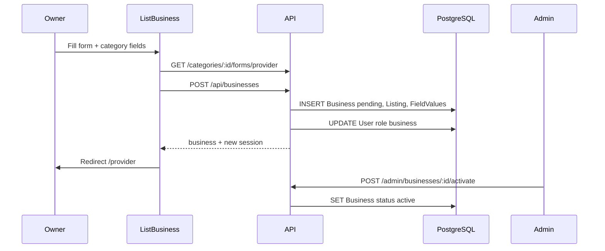
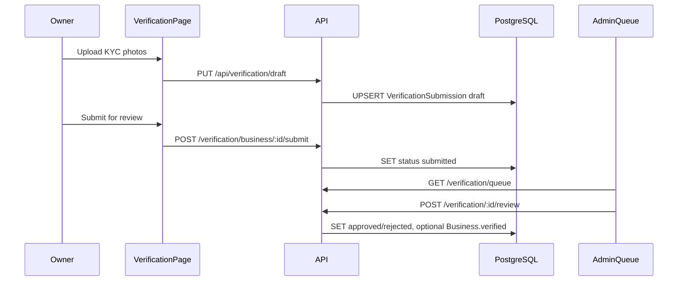
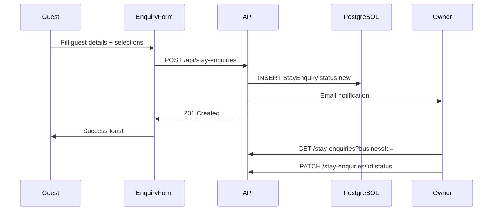
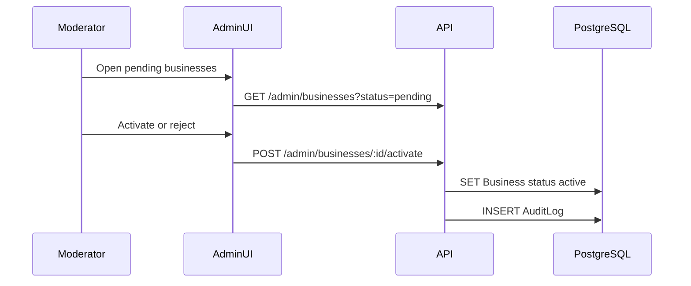
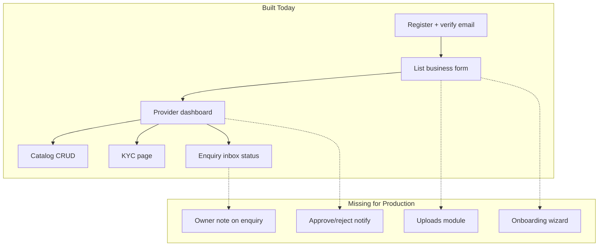

# DialGo / Conforge — Functional Flow Reference

> **Maintainers:** Every new feature or flow change must update this document. See [`.cursor/rules/functional-flow.mdc`](../.cursor/rules/functional-flow.mdc) — update Sections 1–3 (flows), Section 7 (status), Section 5 (gap matrix), and Section 8 (implementation log).

Step-by-step workflow map for the full application: **Public Web** (`apps/web`), **Super Admin** (`apps/super-admin`), and **API** (`apps/api`).

Use this doc to trace any feature from UI → API → database and to spot missing sub-steps.

**Sections:**
- **1–3** — Existing flows (what is built today)
- **4** — Deferred scaffold modules
- **5** — Gap matrix (feature × layer)
- **6** — Priority fixes (quick list)
- **7** — **Module completion guide** — per module: existing ✅, missing ❌/⚠️ (production), extra 💡 (competitive)

---

## 0. How to read this document

### Architecture overview

```text
Browser :8080 (Public Web SPA)
  └─ nginx → static Vite build + /api/* proxy
      └─ Express API :3001 → Prisma → PostgreSQL :5432

Super Admin :8081 (separate Vite SPA)
  └─ same API with RBAC permissions
```

### Status legend

| Icon | Meaning |
|------|---------|
| ✅ | **Complete** — UI + API + DB wired end-to-end |
| ⚠️ | **Partial** — some steps exist; a sub-step is stubbed, hardcoded, or single-layer only |
| ❌ | **Missing** — not implemented or scaffold only |

Step-level tags: `(UI)`, `(API)`, `(DB)`, `(Email)`, `(SMS)` when only that layer exists.

### Flow template

Each flow lists numbered steps: **Page/Route → User action → API → DB → Response → Outcome**, plus a **Missing steps** block where applicable.

**Key source files:**

| App | Routes | API client | Backend |
|-----|--------|------------|---------|
| Public Web | [`apps/web/src/App.tsx`](../apps/web/src/App.tsx) | [`apps/web/src/lib/api.ts`](../apps/web/src/lib/api.ts) | [`apps/api/src/platform/compose-routers.ts`](../apps/api/src/platform/compose-routers.ts) |
| Super Admin | [`apps/super-admin/src/App.tsx`](../apps/super-admin/src/App.tsx) | [`apps/super-admin/src/lib/api.ts`](../apps/super-admin/src/lib/api.ts) | same API |
| Schema | — | — | [`apps/api/prisma/schema.prisma`](../apps/api/prisma/schema.prisma) |

---

## 1. Public Web flows (`apps/web`)

### 1.1 Authentication & Account

#### Flow 1 — User Registration + Email Verification
**Status:** ⚠️ Partial

| Step | Layer | Detail |
|------|-------|--------|
| 1 | UI | User opens `/register`, enters name, email, phone, recovery email (optional), password ([`Auth.tsx`](../apps/web/src/pages/Auth.tsx)) |
| 2 | API | `POST /api/auth/register` — validates with Zod, bcrypt-hashes password ([`auth.routes.ts`](../apps/api/src/modules/auth/auth.routes.ts)) |
| 3 | DB | Inserts `User` (role `user`); creates `VerificationChallenge` (purpose `register`) |
| 4 | Email | Sends 6-digit OTP via `EmailService` (console stub in dev unless SendGrid configured) |
| 5 | API | Issues session cookies: `concierge_session` (JWT access, 15 min) + `concierge_refresh` (7 days, hashed in `RefreshToken`) |
| 6 | UI | Redirect to `/verify-email` ([`VerifyEmail.tsx`](../apps/web/src/pages/VerifyEmail.tsx)) |
| 7 | UI | User enters 6-digit OTP |
| 8 | API | `POST /api/auth/verify-signup-otp` → sets `User.emailVerifiedAt` |
| 9 | Outcome | Registration complete; user can browse, wishlist, and list a business (email required for listing) |

**Missing steps:**
- ✅ Phone OTP verification UI — [`Account.tsx`](../apps/web/src/pages/Account.tsx) calls `/otp/request` + `/otp/verify`
- ⏭️ OAuth sign-in (Google/Facebook) — deferred; requires OAuth provider setup
- ⏭️ MFA enrollment UI — deferred; full TOTP flow not in scope



---

#### Flow 2 — Login / Logout / Session Refresh
**Status:** ✅ Complete

| Step | Layer | Detail |
|------|-------|--------|
| 1 | UI | `/login` — email + password ([`Auth.tsx`](../apps/web/src/pages/Auth.tsx)) |
| 2 | API | `POST /api/auth/login` — bcrypt compare, reject disabled users |
| 3 | DB | Reads `User`; may read `UserRole` / permissions for admin staff |
| 4 | API | Issues access + refresh cookies via `issueSession()` |
| 5 | UI | [`AuthContext.tsx`](../apps/web/src/context/AuthContext.tsx) caches user via `GET /api/auth/me` on load |
| 6 | API | `POST /api/auth/refresh` — rotates refresh token when access expires |
| 7 | UI | Logout calls `POST /api/auth/logout` |
| 8 | DB | Revokes `RefreshToken` row; clears cookies |
| 9 | Outcome | Authenticated session for gated routes (account, wishlist, provider tools) |

**Missing steps:** None for core session flow.

---

#### Flow 3 — Forgot / Reset Password
**Status:** ✅ Complete

| Step | Layer | Detail |
|------|-------|--------|
| 1 | UI | `/forgot-password` — step 1: enter account or recovery email ([`ForgotPassword.tsx`](../apps/web/src/pages/ForgotPassword.tsx)) |
| 2 | API | `POST /api/auth/forgot-password` — creates OTP challenge (purpose `reset`) |
| 3 | UI | Step 2: enter 6-digit OTP |
| 4 | API | `POST /api/auth/verify-reset-otp` → returns short-lived `resetToken` JWT (15 min) |
| 5 | UI | Step 3: enter new password + confirm |
| 6 | API | `POST /api/auth/reset-password` — bcrypt hash, updates `User.passwordHash` |
| 7 | Outcome | User redirected to `/login`; can sign in with new password |

**Missing steps:** None.

---

#### Flow 4 — Account Profile + Avatar
**Status:** ⚠️ Partial

| Step | Layer | Detail |
|------|-------|--------|
| 1 | UI | `/account` — edit name, phone, recovery email ([`Account.tsx`](../apps/web/src/pages/Account.tsx)) |
| 2 | API | `PATCH /api/auth/me` — updates `User` fields |
| 3 | UI | Avatar upload → `api.upload()` then `PATCH /auth/me` with `avatarUrl` |
| 4 | API | `POST /api/uploads` — base64 upload, creates `Asset` + optional `Attachment` |
| 5 | DB | `User.avatarUrl`; `Asset`, `Attachment` (purpose `avatar`) |
| 6 | UI | Lists owned businesses via `GET /api/businesses/mine` |
| 7 | Outcome | Profile saved; quick links to provider dashboard, wishlist, verification |

**Missing steps:**
- ✅ `POST /api/uploads` — [`modules/uploads/`](../apps/api/src/modules/uploads/) restored (base64 upload → Asset)
- ✅ Change password UI — [`Account.tsx`](../apps/web/src/pages/Account.tsx) Security section

---

#### Flow 5 — Recovery Email Verification
**Status:** ✅ Complete

| Step | Layer | Detail |
|------|-------|--------|
| 1 | UI | `/account` — user has recovery email but `recoveryEmailVerifiedAt` is null |
| 2 | API | `POST /api/auth/send-recovery-email-otp` |
| 3 | UI | User enters OTP |
| 4 | API | `POST /api/auth/verify-recovery-email-otp` → sets `recoveryEmailVerifiedAt` |
| 5 | Outcome | Recovery email usable for password reset via `method: "recovery"` |

**Missing steps:** None.

---

#### Flow 6 — Change Password (logged-in)
**Status:** ✅ Complete

| Step | Layer | Detail |
|------|-------|--------|
| 1 | UI | [`Account.tsx`](../apps/web/src/pages/Account.tsx) — Security section |
| 2 | API | `POST /api/auth/change-password` — requires current password ([`auth.routes.ts`](../apps/api/src/modules/auth/auth.routes.ts)) |
| 3 | DB | Updates `User.passwordHash` |

**Missing steps:** None.

---

#### Flow 7 — Phone OTP Verification
**Status:** ✅ Complete

| Step | Layer | Detail |
|------|-------|--------|
| 1 | UI | [`Account.tsx`](../apps/web/src/pages/Account.tsx) — Verify phone section |
| 2 | API | `POST /api/auth/otp/request` with `channel: "sms"`, `purpose: "change"` |
| 3 | API | `POST /api/auth/otp/verify` → sets `User.phoneVerifiedAt` |
| 4 | SMS | `SmsService` (Twilio or email fallback stub) |

**Missing steps:** None.

---

### 1.2 Discovery & Browse

#### Flow 8 — Home Search → Listings Results
**Status:** ✅ Complete

| Step | Layer | Detail |
|------|-------|--------|
| 1 | UI | `/` — hero search: keyword + city; optional geolocation ([`Home.tsx`](../apps/web/src/pages/Home.tsx)) |
| 2 | UI | Debounced autocomplete dropdown on hero + listings search ([`SearchAutocomplete.tsx`](../apps/web/src/components/SearchAutocomplete.tsx)) |
| 3 | API | `GET /api/search/suggest?q=&city=&limit=` — businesses, listing titles, categories, query fallback |
| 4 | UI | Keyboard nav (↑↓ Enter Esc); click suggestion → business profile, category browse, or search results |
| 5 | UI | Saves city/coords to localStorage via [`discovery.ts`](../apps/web/src/lib/discovery.ts) |
| 6 | UI | Navigates to `/listings?q=…&city=…&lat=…&lng=…` |
| 7 | API | `GET /api/search` — text, city, category, rating, open-now, geo radius, `kind`, pagination |
| 8 | DB | Reads `Listing` joined with `Business`, `Category`; filters active businesses |
| 9 | Outcome | Paginated listing cards or map pins on [`Listings.tsx`](../apps/web/src/pages/Listings.tsx) |

**Missing steps:** None for basic search + autocomplete.

---

#### Flow 8b — Listings Map View
**Status:** ✅ Complete

| Step | Layer | Detail |
|------|-------|--------|
| 1 | UI | `/listings` — List \| Map toggle (`?view=map`) on [`Listings.tsx`](../apps/web/src/pages/Listings.tsx) |
| 2 | UI | [`SearchResultsMap.tsx`](../apps/web/src/components/SearchResultsMap.tsx) — Leaflet pins from current search results |
| 3 | UI | Click pin popup or link → `/business/:slug`; fit bounds when multiple markers |
| 4 | API | Reuses existing `GET /api/search` (`lat`/`lng` on listings) — no new endpoint |
| 5 | Outcome | Map discovery for geo-tagged listings |

**Missing steps:** None.

---

#### Flow 8c — Public Page SEO (SPA)
**Status:** ✅ Complete (client-side; see SPA limits)

| Step | Layer | Detail |
|------|-------|--------|
| 1 | UI | [`PageHead.tsx`](../apps/web/src/components/PageHead.tsx) — dynamic `document.title`, meta description, Open Graph, Twitter |
| 2 | UI | `/business/:slug` — business name, city, category; JSON-LD `LocalBusiness` schema |
| 3 | UI | `/listings/:categorySlug` — category title + description |
| 4 | UI | `/listings?q=` — search-results title |
| 5 | Static | [`public/sitemap.xml`](../apps/web/public/sitemap.xml) stub; [`scripts/generate-sitemap.mjs`](../apps/web/scripts/generate-sitemap.mjs) for category URLs |
| 6 | Outcome | Improved share previews and crawl hints (limited without SSR) |

**Missing steps:**
- ⚠️ Crawlers that do not execute JavaScript will not see per-page meta or JSON-LD
- ⚠️ Business profile URLs not in static sitemap until generator run + business index API

---

#### Flow 9 — Category Browse
**Status:** ✅ Complete (minor caveats)

| Step | Layer | Detail |
|------|-------|--------|
| 1 | UI | Home category grid from `GET /api/categories` ([`IndustryGrid.tsx`](../apps/web/src/components/home/IndustryGrid.tsx)) |
| 2 | UI | `/listings/:categorySlug` — category banner, subcategory nav, filtered search |
| 3 | API | `GET /api/categories`, `GET /api/categories/:slug`, `GET /api/search?category=` |
| 4 | DB | `Category` tree (`parentId` hierarchy) |
| 5 | Outcome | Category-scoped discovery |

**Missing steps:**
- ⚠️ Dynamic form composition still evolving per [marketplace_phase1_master.md](../.cursor/plans/marketplace_phase1_master.md) (conditional fields, drag-reorder in admin)

---

#### Flow 10 — Business Profile View
**Status:** ✅ Complete

| Step | Layer | Detail |
|------|-------|--------|
| 1 | UI | `/business/:slug` ([`BusinessDetail.tsx`](../apps/web/src/pages/BusinessDetail.tsx)) |
| 2 | API | `GET /api/businesses/:slug` — business + listing + field values + reviews |
| 3 | API | `GET /api/services/business/:id` — catalog items (rooms, packages, etc.) |
| 4 | DB | `Business`, `Listing`, `ListingFieldValue`, `Service`, `Review` |
| 5 | UI | Renders one of 11 vertical-specific views (stay, rental, travel, event, logistics, education, health, professional, home trade, automotive, electronics) |
| 6 | UI | Map via Leaflet/OpenStreetMap; wishlist button; enquiry form |
| 7 | Outcome | Full business profile for guest or authenticated user |

**Missing steps:** None for view flow.

---

#### Flow 11 — Service / Catalog Item Detail
**Status:** ✅ Complete

| Step | Layer | Detail |
|------|-------|--------|
| 1 | UI | `/business/:slug/items/:itemId` ([`ServiceDetail.tsx`](../apps/web/src/pages/ServiceDetail.tsx)) |
| 2 | API | `GET /api/services/:id` |
| 3 | DB | `Service`, `ServiceFieldValue`, parent `Business` / `Listing` |
| 4 | Outcome | Individual offering detail (price, images, description) |

**Missing steps:** None.

---

#### Flow 12 — Nearby / Geo Search
**Status:** ✅ Complete

| Step | Layer | Detail |
|------|-------|--------|
| 1 | UI | Home or listings page passes `lat`, `lng`, optional `radiusKm` |
| 2 | API | `GET /api/search?lat=&lng=&radiusKm=` |
| 3 | DB | Geo filter on `Listing.lat` / `Listing.lng` |
| 4 | Outcome | Distance-sorted or radius-filtered results |

**Missing steps:** None.

---

### 1.3 Engagement

#### Flow 13 — Submit Review
**Status:** ✅ Complete

| Step | Layer | Detail |
|------|-------|--------|
| 1 | UI | Business profile — rating 1–5 + comment form (requires login) |
| 2 | API | `POST /api/reviews` — one review per user/business pair |
| 3 | DB | Inserts `Review`; updates `Listing.avgRating`, `reviewCount` |
| 4 | Outcome | Review appears on business page |

**Missing steps:**
- ❌ Review photo upload (`review_photo` attachment purpose exists in schema; no UI)
- ❌ Review response from business owner

---

#### Flow 14 — Delete Own Review
**Status:** ❌ Missing UI

| Step | Layer | Detail |
|------|-------|--------|
| 1 | API | `DELETE /api/reviews/:id` — owner or admin ([`reviews.routes.ts`](../apps/api/src/modules/reviews/reviews.routes.ts)) |
| 2 | DB | Deletes `Review`; recalculates averages |

**Missing steps:**
- ❌ No delete button in BusinessDetail or Account

---

#### Flow 15 — Wishlist Add / Remove / View
**Status:** ✅ Complete

| Step | Layer | Detail |
|------|-------|--------|
| 1 | UI | Heart button on listing cards ([`WishlistButton.tsx`](../apps/web/src/components/WishlistButton.tsx)) |
| 2 | UI | If guest → save intent → redirect `/login` → resume after auth |
| 3 | API | `POST /api/wishlist` `{ listingId }` or `DELETE /api/wishlist/:listingId` |
| 4 | DB | `WishlistItem` (unique `userId` + `listingId`) |
| 5 | UI | `/wishlist` lists saved directory listings ([`Wishlist.tsx`](../apps/web/src/pages/Wishlist.tsx)) |
| 6 | Outcome | Saved businesses persist across sessions |

**Missing steps:**
- ❌ Wishlist at service/offering level (Phase 2 — wishlist is on directory `Listing` only)

---

### 1.4 Provider / Business

#### Flow 16 — List a Business (Provider Onboarding)
**Status:** ⚠️ Partial

| Step | Layer | Detail |
|------|-------|--------|
| 1 | UI | `/list-business` — requires login + verified email ([`ListBusiness.tsx`](../apps/web/src/pages/ListBusiness.tsx)) |
| 2 | API | `GET /api/categories/:id/forms/provider` — composed dynamic fields |
| 3 | UI | User selects main/sub category, fills business info, hours, logo/cover, category fields |
| 4 | API | `POST /api/businesses` — creates business + 1:1 listing |
| 5 | DB | `Business` (status `pending`), `Listing`, `ListingFieldValue`; promotes `User.role` → `business` |
| 6 | API | Re-issues access cookie with new role |
| 7 | UI | Redirect to `/provider?business=:id` |
| 8 | Outcome | Business submitted for admin approval |

**Missing steps:**
- ❌ Uploads module missing — logo/cover upload calls fail at API layer
- ⚠️ `asset_ref` / `asset_gallery` category fields show placeholder text in [`CategoryFieldsEditor.tsx`](../apps/web/src/components/CategoryFieldsEditor.tsx)
- ⚠️ Provider cannot pick a different subcategory when creating catalog items later



---

#### Flow 17 — Edit Business Profile
**Status:** ⚠️ Partial (uploads)

| Step | Layer | Detail |
|------|-------|--------|
| 1 | UI | `/business/:slug/edit` — owner or admin only ([`EditBusiness.tsx`](../apps/web/src/pages/EditBusiness.tsx)) |
| 2 | API | `GET /api/businesses/:slug`, `GET /api/categories/:id/forms/provider` |
| 3 | UI | Edit title, description, hours, social links, logo, cover, dynamic fields |
| 4 | API | `PATCH /api/businesses/:id` |
| 5 | DB | Updates `Business`, `Listing`, `ListingFieldValue` |
| 6 | Outcome | Profile updated (public if business is active) |

**Missing steps:**
- ❌ Uploads module — logo/cover upload broken until `modules/uploads` restored

---

#### Flow 18 — Provider Dashboard
**Status:** ✅ Complete

| Step | Layer | Detail |
|------|-------|--------|
| 1 | UI | `/provider` ([`ProviderDashboard.tsx`](../apps/web/src/pages/ProviderDashboard.tsx)) |
| 2 | API | `GET /api/businesses/mine` |
| 3 | DB | Lists `Business` rows owned by user |
| 4 | UI | Shows approval status badges; links to listings, enquiries, verification, edit |
| 5 | Outcome | Owner overview of all businesses |

**Missing steps:**
- ❌ Business analytics (views, leads, conversion) — deferred module

---

#### Flow 19 — Catalog / Service CRUD
**Status:** ⚠️ Partial

| Step | Layer | Detail |
|------|-------|--------|
| 1 | UI | `/provider/listings` — list services ([`ProviderListings.tsx`](../apps/web/src/pages/ProviderListings.tsx)) |
| 2 | UI | `/provider/listings/create` or `/:serviceId/edit` |
| 3 | API | `GET /api/categories/:id/forms/listing` for dynamic service fields |
| 4 | API | `POST /api/services` — non-admin creates with `approvalStatus: pending` |
| 5 | API | `PATCH /api/services/:id`, `DELETE /api/services/:id` (soft deactivate) |
| 6 | DB | `Service`, `ServiceFieldValue` |
| 7 | Outcome | Offerings visible on business profile only when `approved` + `isActive` |

**Missing steps:**
- ❌ Uploads — service gallery images fail without upload module
- ⚠️ Provider sees pending status but no in-app notification when admin approves/rejects

---

#### Flow 20 — KYC Verification (Provider)
**Status:** ⚠️ Partial

| Step | Layer | Detail |
|------|-------|--------|
| 1 | UI | `/verification` — select business ([`Verification.tsx`](../apps/web/src/pages/Verification.tsx)) |
| 2 | API | `GET /api/verification/business/:id` — current draft/submission |
| 3 | UI | Upload owner photo, location, storefront, document, selfie, video (private) |
| 4 | API | `PUT /api/verification/draft` — upsert draft |
| 5 | DB | `VerificationSubmission` (status `draft`); `Asset` + `Attachment` (KYC purposes) |
| 6 | UI | Submit for review |
| 7 | API | `POST /api/verification/business/:id/submit` — requires all mandatory photos |
| 8 | DB | Status → `submitted` |
| 9 | Outcome | Queued for admin review |

**Missing steps:**
- ❌ Uploads module — KYC photo upload broken
- ❌ Provider notification when approved/rejected



---

#### Flow 21 — Provider Enquiry Inbox
**Status:** ⚠️ Partial

| Step | Layer | Detail |
|------|-------|--------|
| 1 | UI | `/provider/enquiries?business=:id` ([`ProviderEnquiries.tsx`](../apps/web/src/pages/ProviderEnquiries.tsx)) |
| 2 | API | `GET /api/{vertical}-enquiries?businessId=` — all 11 vertical endpoints |
| 3 | UI | Lists enquiries with guest contact, dates, selections |
| 4 | UI | Status dropdown: `new` → `viewed` → `responded` → `closed` |
| 5 | API | `PATCH /api/{vertical}-enquiries/:id` `{ status }` |
| 6 | DB | Updates enquiry row `status` |
| 7 | Outcome | Owner tracks lead pipeline |

**Missing steps:**
- ❌ `ownerNote` field — API supports it; no UI in provider or super-admin enquiry pages
- ❌ Email/SMS to guest when status changes

---

### 1.5 Enquiry Submission (11 verticals)

All verticals share the same pattern. Guest or logged-in user submits from the business profile enquiry form.

| # | Vertical | UI form | API | DB model |
|---|----------|---------|-----|----------|
| 22 | Stays | [`StayEnquiryForm.tsx`](../apps/web/src/components/stay/StayEnquiryForm.tsx) | `POST /api/stay-enquiries` | `StayEnquiry` |
| 23 | Rentals | [`RentalEnquiryForm.tsx`](../apps/web/src/components/rental/RentalEnquiryForm.tsx) | `POST /api/rental-enquiries` | `RentalEnquiry` |
| 24 | Travel | [`TravelEnquiryForm.tsx`](../apps/web/src/components/travel/TravelEnquiryForm.tsx) | `POST /api/travel-enquiries` | `TravelEnquiry` |
| 25 | Events | [`EventEnquiryForm.tsx`](../apps/web/src/components/event/EventEnquiryForm.tsx) | `POST /api/event-enquiries` | `EventEnquiry` |
| 26 | Logistics | [`LogisticsEnquiryForm.tsx`](../apps/web/src/components/logistics/LogisticsEnquiryForm.tsx) | `POST /api/logistics-enquiries` | `LogisticsEnquiry` |
| 27 | Education | [`EducationEnquiryForm.tsx`](../apps/web/src/components/education/EducationEnquiryForm.tsx) | `POST /api/education-enquiries` | `EducationEnquiry` |
| 28 | Health | [`HealthEnquiryForm.tsx`](../apps/web/src/components/health/HealthEnquiryForm.tsx) | `POST /api/health-enquiries` | `HealthEnquiry` |
| 29 | Professional | [`ProfessionalEnquiryForm.tsx`](../apps/web/src/components/professional/ProfessionalEnquiryForm.tsx) | `POST /api/professional-enquiries` | `ProfessionalEnquiry` |
| 30 | Home trade | [`HomeEnquiryForm.tsx`](../apps/web/src/components/home/HomeEnquiryForm.tsx) | `POST /api/home-trade-enquiries` | `HomeTradeEnquiry` |
| 31 | Automotive | [`AutomotiveEnquiryForm.tsx`](../apps/web/src/components/automotive/AutomotiveEnquiryForm.tsx) | `POST /api/automotive-enquiries` | `AutomotiveEnquiry` |
| 32 | Electronics | [`ElectronicsEnquiryForm.tsx`](../apps/web/src/components/electronics/ElectronicsEnquiryForm.tsx) | `POST /api/electronics-enquiries` | `ElectronicsEnquiry` |

**Shared steps (example: Flow 22 — Stay Enquiry):** ✅ Complete

| Step | Layer | Detail |
|------|-------|--------|
| 1 | UI | Guest opens stay business profile → enquiry modal/form |
| 2 | UI | Enters guest name, email, phone, dates, room selections |
| 3 | API | Validates business `active`, category is stay-type, selected services approved |
| 4 | DB | Inserts enquiry row; links `userId` if authenticated |
| 5 | Email | Notifies business owner via `EmailService` (stub in dev) |
| 6 | Audit | `writeAuditLog` action `{vertical}_enquiry.create` |
| 7 | UI | Toast success |
| 8 | Outcome | Owner sees enquiry in provider inbox + super-admin queue |

**Cross-cutting missing steps (all verticals):**
- ❌ "My enquiries" page for logged-in users to track submitted enquiries
- ❌ SMS confirmation to guest
- ⚠️ Production email requires SendGrid (or similar) env configuration



---

### 1.6 Static & Utility Pages

#### Flow 33 — Static Content Pages
**Status:** ✅ Complete

| Step | Layer | Detail |
|------|-------|--------|
| 1 | UI | `/about`, `/careers`, `/terms`, `/privacy`, `/contact` ([`Content.tsx`](../apps/web/src/pages/Content.tsx)) |
| 2 | Outcome | Static marketing/legal content; no API |

---

#### Flow 34 — Admin Redirect
**Status:** ✅ Complete

| Step | Layer | Detail |
|------|-------|--------|
| 1 | UI | `/admin` → redirects to Super Admin URL (`VITE_ADMIN_URL`, default `http://localhost:8081`) |
| 2 | Outcome | Staff use separate admin app |

---

## 2. Super Admin flows (`apps/super-admin`)

All routes require authenticated staff with RBAC permissions (not just legacy `admin` role).

#### Flow 35 — Staff Login
**Status:** ✅ Complete

| Step | Layer | Detail |
|------|-------|--------|
| 1 | UI | `/login` ([`LoginPage.tsx`](../apps/super-admin/src/pages/LoginPage.tsx)) |
| 2 | API | `POST /api/auth/login` — same auth as public web |
| 3 | API | `GET /api/auth/me` — returns `permissions[]`, `roles[]` |
| 4 | Outcome | Session cookie; gated admin routes |

---

#### Flow 36 — Dashboard Stats
**Status:** ✅ Complete

| Step | Layer | Detail |
|------|-------|--------|
| 1 | UI | `/` ([`DashboardPage.tsx`](../apps/super-admin/src/pages/DashboardPage.tsx)) |
| 2 | API | `GET /api/admin/stats`, `GET /api/admin/settings` |
| 3 | DB | Aggregates users, businesses, listings, pending counts, categories |
| 4 | Outcome | Platform overview with links to pending queues |

---

#### Flow 37 — Business Moderation
**Status:** ✅ Complete

| Step | Layer | Detail |
|------|-------|--------|
| 1 | UI | `/businesses` — filter by status ([`BusinessesPage.tsx`](../apps/super-admin/src/pages/BusinessesPage.tsx)) |
| 2 | API | `GET /api/admin/businesses`, `GET /api/admin/businesses/:id` |
| 3 | UI | Activate, suspend, reject (with reason), delete |
| 4 | API | `POST …/activate`, `…/suspend`, `…/reject`, `DELETE …/businesses/:id` |
| 5 | DB | Updates `Business.status`, `rejectionReason`; audit log |
| 6 | Outcome | Provider visibility controlled |



---

#### Flow 38 — Listing / Service Approval
**Status:** ✅ Complete

| Step | Layer | Detail |
|------|-------|--------|
| 1 | UI | `/listings` ([`ListingsPage.tsx`](../apps/super-admin/src/pages/ListingsPage.tsx)) |
| 2 | API | `GET /api/admin/listings?status=pending` |
| 3 | UI | Approve, reject (reason), delete |
| 4 | API | `POST /admin/listings/:id/approve`, `…/reject`, `DELETE …/listings/:id` |
| 5 | DB | Updates `Service.approvalStatus`, `rejectionReason` |
| 6 | Outcome | Offerings go live on public profile when approved |

---

#### Flow 39 — Category Management
**Status:** ⚠️ Partial

| Step | Layer | Detail |
|------|-------|--------|
| 1 | UI | `/categories`, `/categories/:id` ([`CategoriesPage.tsx`](../apps/super-admin/src/pages/CategoriesPage.tsx)) |
| 2 | API | `GET/POST/PATCH/DELETE /api/admin/categories` |
| 3 | UI | Create/edit category name, slug, images, banner, active flag |
| 4 | DB | `Category` |
| 5 | Outcome | Taxonomy drives public browse + dynamic forms |

**Missing steps:**
- ❌ Drag-and-drop field reorder in category list (API `PUT /admin/category-fields/reorder` exists; limited UI)
- ⚠️ Conditional field rules — schema has `conditionalRules`; no admin UI to configure

---

#### Flow 40 — Form Builder
**Status:** ⚠️ Partial

| Step | Layer | Detail |
|------|-------|--------|
| 1 | UI | `/categories/:id/forms` ([`FormBuilderPage.tsx`](../apps/super-admin/src/pages/FormBuilderPage.tsx)) |
| 2 | API | `GET /api/admin/forms/:categoryId`, CRUD on `/admin/categories/:id/fields` |
| 3 | DB | `CategoryField` (scope `listing` \| `service` \| `business`) |
| 4 | Outcome | Fields appear in composed public forms |

**Missing steps:**
- ❌ Conditional field builder UI
- ❌ Platform common-field catalog toggle per category (Phase 1 gap)

---

#### Flow 41 — KYC Review Queue
**Status:** ✅ Complete

| Step | Layer | Detail |
|------|-------|--------|
| 1 | UI | `/verification` ([`VerificationPage.tsx`](../apps/super-admin/src/pages/VerificationPage.tsx)) |
| 2 | API | `GET /api/verification/queue` — requires `verification.review` permission |
| 3 | UI | View KYC photos; approve or reject |
| 4 | API | `POST /api/verification/:id/review` |
| 5 | DB | `VerificationSubmission.status`; may set `Business.verified` and activate |
| 6 | Outcome | Verified badge on public profile |

---

#### Flow 42 — Enquiry Queues (×11)
**Status:** ⚠️ Partial

| Step | Layer | Detail |
|------|-------|--------|
| 1 | UI | `/stay-enquiries`, `/rental-enquiries`, … `/electronics-enquiries` |
| 2 | API | `GET /api/{vertical}-enquiries` (admin with `businesses.read`) |
| 3 | UI | Filter/list enquiries; update status dropdown |
| 4 | API | `PATCH /api/{vertical}-enquiries/:id` |
| 5 | Outcome | Staff can monitor platform-wide enquiries |

**Missing steps:**
- ❌ `ownerNote` textarea — API supports; no admin UI

---

#### Flow 43 — Users Management
**Status:** ✅ Complete

| Step | Layer | Detail |
|------|-------|--------|
| 1 | UI | `/users` ([`UsersPage.tsx`](../apps/super-admin/src/pages/UsersPage.tsx)) |
| 2 | API | `GET /api/admin/users`, `PATCH /api/admin/users/:id` (disable/enable) |
| 3 | DB | `User.disabledAt` |
| 4 | Outcome | Account moderation |

---

#### Flow 44 — RBAC Roles
**Status:** ✅ Complete

| Step | Layer | Detail |
|------|-------|--------|
| 1 | UI | `/roles` ([`RolesPage.tsx`](../apps/super-admin/src/pages/RolesPage.tsx)) |
| 2 | API | `GET /api/admin/roles`, `POST/DELETE /api/admin/users/:id/roles` |
| 3 | DB | `RoleDef`, `Permission`, `RolePermission`, `UserRole` |
| 4 | Outcome | Fine-grained admin access |

---

#### Flow 45 — Asset Browser
**Status:** ✅ Complete

| Step | Layer | Detail |
|------|-------|--------|
| 1 | UI | `/assets` ([`AssetsPage.tsx`](../apps/super-admin/src/pages/AssetsPage.tsx)) |
| 2 | API | `GET /api/admin/assets` — requires `assets.read_private` or `businesses.read` |
| 3 | DB | `Asset`, `Attachment` |
| 4 | Outcome | Browse uploaded public/private files |

---

#### Flow 46 — Audit Log
**Status:** ✅ Complete

| Step | Layer | Detail |
|------|-------|--------|
| 1 | UI | `/audit` ([`AuditPage.tsx`](../apps/super-admin/src/pages/AuditPage.tsx)) |
| 2 | API | `GET /api/admin/audit` |
| 3 | DB | `AuditLog` |
| 4 | Outcome | Trace admin and enquiry actions |

---

## 3. API / Infrastructure flows

#### Flow 47 — File Upload
**Status:** ❌ Critical gap

| Step | Layer | Detail |
|------|-------|--------|
| 1 | UI | Public web + super-admin call `POST /api/uploads` (base64 payload) |
| 2 | API | **Expected:** [`modules/uploads`](../apps/api/src/modules/uploads/) — **directory missing from disk** despite import in [`compose-routers.ts`](../apps/api/src/platform/compose-routers.ts) |
| 3 | DB | `Asset`, `Attachment`; public files at `/uploads/public/*` |
| 4 | Outcome | Avatars, logos, covers, KYC, gallery — **all broken until module restored** |

---

#### Flow 48 — Asset Attachment Lookup
**Status:** ⚠️ Partial

| Step | Layer | Detail |
|------|-------|--------|
| 1 | API | `GET /api/assets/entity/:entityType/:entityId` |
| 2 | DB | Joins `Attachment` → `Asset` |
| 3 | Outcome | Used internally for KYC dual-write; limited public UI surfacing |

---

#### Flow 49 — Session, CSRF & Authorization
**Status:** ✅ Complete

| Step | Layer | Detail |
|------|-------|--------|
| 1 | API | HttpOnly JWT cookie + refresh rotation ([`shared/auth`](../apps/api/src/shared/auth/index.ts)) |
| 2 | API | CSRF double-submit: `concierge_csrf` cookie + `X-CSRF-Token` header on mutating requests |
| 3 | API | RBAC `requirePermission()` on admin routes; ownership checks on business/service/enquiry |
| 4 | Outcome | Secure multi-layer authorization |

---

#### Flow 50 — Health & Readiness
**Status:** ✅ Complete

| Step | Layer | Detail |
|------|-------|--------|
| 1 | API | `GET /api/health` — liveness + DB ping |
| 2 | API | `GET /api/ready` — readiness probe for orchestrators |
| 3 | Outcome | Docker/CI health checks |

---

## 4. Deferred / scaffold modules (all ❌)

These modules exist as folders + README stubs but are **not mounted** in [`compose-routers.ts`](../apps/api/src/platform/compose-routers.ts). No UI exists.

| Module | Path | Planned capability |
|--------|------|-------------------|
| Payments | [`apps/api/src/modules/payments/`](../apps/api/src/modules/payments/) | JD Pay-style deposits, UPI/Stripe |
| Messaging | [`apps/api/src/modules/messaging/`](../apps/api/src/modules/messaging/) | User–business in-app chat |
| Ads | [`apps/api/src/modules/ads/`](../apps/api/src/modules/ads/) | Promoted listings, campaigns |
| Analytics | [`apps/api/src/modules/analytics/`](../apps/api/src/modules/analytics/) | Business dashboard metrics |
| Notifications | [`apps/api/src/modules/notifications/`](../apps/api/src/modules/notifications/) | Push/SMS/email event hub |

**Also deferred (no scaffold):**
- ❌ OAuth social login
- ❌ Voice search
- ❌ Elasticsearch / Redis caching
- ❌ Offering-level search (Phase 2 — search indexes directory `Listing` only)
- ❌ Real-time booking with time slots (enquiries only, not calendar booking)

---

## 5. Gap summary matrix

Quick reference: which layers exist per feature. `—` = not applicable.

| Feature | Web UI | API | DB | Admin UI | Notify | Overall |
|---------|--------|-----|----|---------:|--------|---------|
| User register + email verify | ✅ | ✅ | ✅ | — | ⚠️ | ⚠️ |
| Login / logout / refresh | ✅ | ✅ | ✅ | ✅ | — | ✅ |
| Forgot / reset password | ✅ | ✅ | ✅ | — | ⚠️ | ✅ |
| Account profile | ✅ | ✅ | ✅ | — | — | ⚠️ |
| Change password (logged-in) | ❌ | ✅ | ✅ | — | — | ❌ |
| Phone OTP verify | ❌ | ✅ | ✅ | — | ⚠️ | ❌ |
| Recovery email verify | ✅ | ✅ | ✅ | — | ⚠️ | ✅ |
| OAuth login | ❌ | ❌ | — | — | — | ❌ |
| MFA | ❌ | ⚠️ | ✅ | — | — | ❌ |
| Home / search / geo | ✅ | ✅ | ✅ | — | — | ✅ |
| Search autocomplete | ✅ | ✅ | ✅ | — | — | ✅ |
| Listings map view | ✅ | ✅ | ✅ | — | — | ✅ |
| Public page SEO (SPA) | ⚠️ | — | — | — | — | ⚠️ |
| Category browse | ✅ | ✅ | ✅ | ✅ | — | ✅ |
| Business profile view | ✅ | ✅ | ✅ | — | — | ✅ |
| Service detail | ✅ | ✅ | ✅ | — | — | ✅ |
| Submit review | ✅ | ✅ | ✅ | — | — | ✅ |
| Delete review | ✅ | ✅ | ✅ | — | — | ✅ |
| Report review | ✅ | ✅ | ✅ | ✅ | — | ✅ |
| Review moderation | — | ✅ | ✅ | ✅ | — | ✅ |
| Wishlist | ✅ | ✅ | ✅ | — | — | ✅ |
| List business | ✅ | ✅ | ✅ | ✅ | — | ⚠️ |
| Edit business | ✅ | ✅ | ✅ | — | — | ⚠️ |
| Provider dashboard | ✅ | ✅ | ✅ | — | — | ✅ |
| Catalog CRUD | ✅ | ✅ | ✅ | ✅ | — | ⚠️ |
| KYC submission | ✅ | ✅ | ✅ | ✅ | — | ⚠️ |
| KYC review | — | ✅ | ✅ | ✅ | — | ✅ |
| Enquiry submit (×11) | ✅ | ✅ | ✅ | ✅ | ⚠️ | ⚠️ |
| Enquiry ownerNote | ✅ | ✅ | ✅ | ✅ | — | ✅ |
| My enquiries (consumer) | ✅ | ✅ | ✅ | — | — | ✅ |
| Guest enquiry lookup | ✅ | ✅ | ✅ | — | — | ✅ |
| Enquiry CSV export (provider) | ✅ | ✅ | ✅ | — | — | ✅ |
| Verified search filter | ✅ | ✅ | ✅ | — | — | ✅ |
| File uploads | ✅ | ❌ | ✅ | ✅ | — | ❌ |
| Business moderation | — | ✅ | ✅ | ✅ | — | ✅ |
| Service approval | — | ✅ | ✅ | ✅ | — | ✅ |
| Category / form builder | — | ✅ | ✅ | ⚠️ | — | ⚠️ |
| RBAC users/roles | — | ✅ | ✅ | ✅ | — | ✅ |
| Audit log | — | ✅ | ✅ | ✅ | — | ✅ |
| Payments | ❌ | ❌ | ❌ | ❌ | ❌ | ❌ |
| Messaging / chat | ❌ | ❌ | ❌ | ❌ | ❌ | ❌ |
| Ads / promotions | ❌ | ❌ | ❌ | ❌ | ❌ | ❌ |
| Business analytics | ❌ | ❌ | ❌ | ❌ | — | ❌ |
| Notification hub | ❌ | ❌ | ❌ | ❌ | ❌ | ❌ |

---

## 6. Priority missing workflows

Fix or build these first — they block multiple flows above:

1. **❌ Restore `apps/api/src/modules/uploads/`** — unblocks avatar, logo, cover, KYC, service gallery, super-admin category images
2. **❌ Enquiry `ownerNote` UI** — provider inbox + super-admin enquiry pages (API already accepts field)
3. **❌ Change password UI** — Account page calling `POST /api/auth/change-password`
4. **❌ Phone OTP UI** — Account page calling `/otp/request` + `/otp/verify`
5. **❌ Delete review UI** — business profile or account
6. **❌ My enquiries page** — logged-in user enquiry history across verticals
7. **❌ Production email/SMS** — configure SendGrid + Twilio env vars (currently dev console stub)

---

## 7. Production readiness — missing & suggested functionality by module

This section is the **module completion guide**. For each platform area it lists:

1. **What exists today** — links to built flows (Sections 1–3)
2. **Missing functionality** — ❌ required before production (or ⚠️ partial)
3. **Suggested extra functionality** — 💡 competitive / Phase 2+ enhancements

Use with Section 5 (gap matrix) and Section 6 (priority fixes).

### Module map (three apps, one platform)

```text
┌─────────────────────────────────────────────────────────────────────────┐
│                        DIALGO PLATFORM                                  │
├─────────────────────┬──────────────────────┬────────────────────────────┤
│  CONSUMER (Web)     │  PROVIDER (Web)      │  OPERATIONS (Super Admin)  │
│  Search & discover  │  Create & manage     │  Configure & moderate      │
│  Enquire & review   │  business + catalog  │  categories, RBAC, KYC     │
├─────────────────────┴──────────────────────┴────────────────────────────┤
│                         API (apps/api)                                  │
│  Auth · Search · Businesses · Services · Enquiries · Admin · Assets     │
└─────────────────────────────────────────────────────────────────────────┘
```

| Module | Primary app | Role | Production goal |
|--------|-------------|------|-------------------|
| A — Consumer discovery | `apps/web` | Guest / user **finds businesses** | Justdial-style search, filters, maps, trust |
| B — Provider portal | `apps/web` | Owner **creates & runs a business** | Onboard → catalog → leads → KYC |
| C — Auth & account | `apps/web` + API | All users | Secure identity, recovery, compliance |
| D — Enquiry & leads | `apps/web` + API | Consumer + provider | Submit → respond → notify both sides |
| E — Reviews & engagement | `apps/web` + API | Consumer | Ratings, wishlist, social proof |
| F — Super Admin ops | `apps/super-admin` | Staff | Taxonomy, moderation, RBAC, KYC |
| G — API & infra | `apps/api` | Platform | Uploads, email/SMS, security, scale |
| H — Growth & monetization | All (deferred) | Business + platform | Payments, ads, analytics, messaging |

**Legend for tables below:**

| Icon | Meaning |
|------|---------|
| ❌ | Missing — must build for production (or module is incomplete without it) |
| ⚠️ | Partial — started but not finished end-to-end |
| 💡 | Suggested extra — not blocking launch; adds competitiveness |

---

### Module A — Consumer discovery platform (`apps/web`)

**Purpose:** The **public marketplace** where users search by keyword/city/location, browse categories, open business profiles, view catalog items, save favourites, and start an enquiry.

#### Existing functionality ✅

| Flow | Feature |
|------|---------|
| 8 | Home hero search → `/listings` results |
| 9 | Category tree browse (`/listings/:categorySlug`) |
| 10 | Business profile (11 vertical layouts) |
| 11 | Service / catalog item detail |
| 12 | Geo / nearby search (`lat`, `lng`, `radiusKm`) |
| 15 | Wishlist (with login redirect) |
| 33 | Static pages (about, terms, contact) |

Partial: recent listings + saved city in localStorage ([`discovery.ts`](../apps/web/src/lib/discovery.ts)); OpenStreetMap on profiles; filters `rating`, `open`, `kind` in API.

#### Missing functionality (required) ❌ / ⚠️

| ID | Feature | Priority | Suggested route / API | Notes |
|----|---------|----------|----------------------|-------|
| A-M1 | ✅ Search autocomplete / typeahead | P1 | `GET /api/search/suggest?q=&city=` | [`SearchAutocomplete.tsx`](../apps/web/src/components/SearchAutocomplete.tsx), Home + Listings search bars |
| A-M2 | ✅ Sort results (rating, distance, relevance) | P1 | `GET /api/search?sort=` | Sort dropdown on [`Listings.tsx`](../apps/web/src/pages/Listings.tsx); API `sort=relevance|rating|distance` |
| A-M3 | ✅ Map view of search results | P1 | Reuse search + map pins | List \| Map toggle on [`Listings.tsx`](../apps/web/src/pages/Listings.tsx); [`SearchResultsMap.tsx`](../apps/web/src/components/SearchResultsMap.tsx) |
| A-M4 | ✅ “Open now” badge + filter accuracy | P1 | Hours JSON + timezone | API returns `openNow`; badge on [`ListingCard`](../apps/web/src/components/ListingCard.tsx) |
| A-M5 | ✅ SEO for public pages | P1 | Client-side meta + JSON-LD | [`PageHead.tsx`](../apps/web/src/components/PageHead.tsx), `sitemap.xml`, generate script |
| A-M6 | ✅ Share / deep link | P2 | UI only | Copy link, WhatsApp share on business profile |
| A-M7 | ✅ Verified-business filter | P2 | `GET /api/search?verified=true` | Filter chip “Verified only” |
| A-M8 | ❌ Price range filter | P2 | Search join `Service.price` | Min/max for supplier listings |
| A-M9 | ✅ Empty / zero-results UX | P2 | UI | Suggest nearby cities, popular categories |
| A-M10 | ⏭️ Service/offering in search results | P3 | Search index `Service` | Phase 2 — deferred |
| A-M11 | ✅ Recently viewed businesses | P3 | Extend `discovery.ts` | Home section; persist last 10 profile views |

#### Suggested extra functionality 💡

| ID | Feature | Value | Suggested implementation |
|----|---------|-------|-------------------------|
| A-E1 | ⏭️ Voice search | Justdial differentiator | Deferred — Web Speech API + search integration |
| A-E2 | 💡 Saved searches + alerts | Retention | `SavedSearch` model; email when new listings match |
| A-E3 | 💡 Compare businesses (2–3 side by side) | Decision support | `/compare?ids=` local state or account-stored |
| A-E4 | 💡 Trending / popular near you | Discovery | Admin or algo-driven “Trending in {city}” on home |
| A-E5 | 💡 Breadcrumb + structured nav | SEO + UX | Home → Category → Subcategory → Business |
| A-E6 | 💡 One-tap Call / Directions | Mobile conversion | `tel:` link; Google Maps directions URL from lat/lng |
| A-E7 | 💡 Multi-language UI (EN + Hindi) | India market | i18n (`react-i18next`); category names from DB |
| A-E8 | 💡 PWA / installable app | Mobile reach | Vite PWA plugin; offline cached home |
| A-E9 | 💡 Filter by payment modes | B2B/supplier vertical | Category field `payment_modes` as search facet |
| A-E10 | 💡 “Near me” without manual city | UX | Browser geolocation prompt on first visit (partial coords exist) |

**Production checklist — Module A:** A-M2, A-M4 complete; A-M1, A-M3, A-M5 shipped (client-side SEO — SSR optional for crawlers).

---

### Module B — Provider / business portal (`apps/web`)

**Purpose:** Where owners **create a business listing**, wait for approval, **manage catalog/services**, **respond to enquiries**, and **complete KYC**.

#### Existing functionality ✅

| Flow | Feature |
|------|---------|
| 16 | List business (`/list-business`) + dynamic category fields |
| 17 | Edit business (`/business/:slug/edit`) |
| 18 | Provider dashboard (`/provider`) |
| 19 | Catalog CRUD (`/provider/listings`) |
| 20 | KYC submission (`/verification`) |
| 21 | Enquiry inbox — status updates only |

Requires verified email before listing. Role promoted to `business` on create. Services created as `approvalStatus: pending`.

#### Missing functionality (required) ❌ / ⚠️

| ID | Feature | Priority | Suggested route / API | Notes |
|----|---------|----------|----------------------|-------|
| B-M1 | ✅ File uploads working | **P0** | `POST /api/uploads` | [`modules/uploads/`](../apps/api/src/modules/uploads/) — base64 → StoragePort → Asset |
| B-M2 | ✅ Approval / rejection notifications | P0 | Email/SMS hooks on admin activate/reject | [`enquiry-notifications.ts`](../apps/api/src/modules/bookings/enquiry-notifications.ts) + [`admin.service.ts`](../apps/api/src/modules/admin/admin.service.ts) |
| B-M3 | ✅ Enquiry `ownerNote` + reply UI | P0 | [`ProviderEnquiries.tsx`](../apps/web/src/pages/ProviderEnquiries.tsx) | [`OwnerNoteField`](../apps/web/src/components/OwnerNoteField.tsx) on all vertical inboxes |
| B-M4 | ❌ Multi-step onboarding wizard | P1 | `/list-business` steps | Category → Info → Hours → Photos → Fields → Review; reduce drop-off |
| B-M5 | ⚠️ Dynamic `asset_ref` / `asset_gallery` fields | P1 | Wire [`CategoryFieldsEditor`](../apps/web/src/components/CategoryFieldsEditor.tsx) | Depends B-M1 |
| B-M6 | ❌ Pause / deactivate own listing | P1 | `POST /api/businesses/:id/pause` | Self-service without admin ticket |
| B-M7 | ✅ Rejection reason display + resubmit | P1 | UI on `/provider` | [`ProviderDashboard.tsx`](../apps/web/src/pages/ProviderDashboard.tsx) banner + edit link |
| B-M8 | ❌ Claim existing listing | P2 | `/claim-business`, `POST /api/businesses/:id/claim` | OTP verify phone/email matches seeded listing |
| B-M9 | ❌ Business hours exceptions / holidays | P2 | `Listing.hoursExceptions` JSON | Calendar UI on edit business |
| B-M10 | ❌ Bulk catalog CSV import | P2 | `POST /api/services/import` | Hotels, rental shops with many SKUs |
| B-M11 | ❌ Catalog item duplicate / template | P2 | UI “Duplicate service” | Copy row + field values |
| B-M12 | ❌ Team members / staff accounts | P3 | `/provider/team`, `BusinessMember` table | Receptionist manages enquiries only |
| B-M13 | ❌ Provider notification centre | P2 | `/provider/notifications` | In-app list: new enquiry, approved, new review |

#### Suggested extra functionality 💡

| ID | Feature | Value | Suggested implementation |
|----|---------|-------|-------------------------|
| B-E1 | 💡 Provider analytics dashboard | Owner retention | `/provider/analytics` — views, enquiries, conversion (Module H-6) |
| B-E2 | 💡 QR code for business profile | Offline marketing | Generate PNG for `/business/:slug` |
| B-E3 | 💡 Embed widget / badge | Distribution | `<script>` or iframe for owner’s website |
| B-E4 | ⏭️ Import from Google Business Profile | Faster onboarding | Deferred — requires Google OAuth + field mapping |
| B-E5 | ⏭️ Multi-branch / chain locations | Enterprise providers | Deferred — parent/child Business model |
| B-E6 | 💡 Promotional banner on own profile | Self-serve marketing | Owner-uploaded banner with date range |
| B-E7 | 💡 Inventory / stock count (supplier) | B2B catalog | `Service.stockQty`; “Out of stock” badge |
| B-E8 | 💡 Quote builder (PDF export) | B2B | Generate PDF from enquiry + catalog selections |
| B-E9 | 💡 Listing edit history / audit | Trust + support | Show last modified; link to admin audit |
| B-E10 | 💡 WhatsApp Business deep link | India market | Pre-filled wa.me from profile (partial in home-trade views) |



**Production checklist — Module B:** B-M1 → B-M2 → B-M3 → B-M7 (minimum).

---

### Module C — Auth & account (`apps/web` + API)

**Purpose:** Sign up, sign in, verify identity, manage profile, recover account — for **consumers, providers, and admin staff**.

#### Existing functionality ✅

| Flow | Feature |
|------|---------|
| 1 | Register + email OTP verify |
| 2 | Login, logout, session refresh |
| 3 | Forgot / reset password (account or recovery email) |
| 4 | Profile PATCH, avatar upload (UI calls upload API) |
| 5 | Recovery email verify |

Cookie JWT + refresh rotation + CSRF. Rate limits on auth routes.

#### Missing functionality (required) ❌ / ⚠️

| ID | Feature | Priority | Suggested route / API | Notes |
|----|---------|----------|----------------------|-------|
| C-M1 | ✅ Change password (logged-in) | P0 | `/account`, `POST /api/auth/change-password` | [`Account.tsx`](../apps/web/src/pages/Account.tsx) Security section |
| C-M2 | ⚠️ Production email delivery | **P0** | SendGrid/SES env | OTP, reset, enquiry emails — wire env; stub in dev |
| C-M3 | ✅ Phone OTP verification UI | P1 | Account page, `/otp/request` + `/otp/verify` | [`Account.tsx`](../apps/web/src/pages/Account.tsx) |
| C-M4 | ⏭️ MFA for admin staff | P1 | TOTP enroll; enforce on super-admin login | Deferred — full MFA enrollment flow |
| C-M5 | ⏭️ Account deletion (GDPR/DPDP) | P1 | `DELETE /api/auth/me` + 30-day grace | Deferred — anonymization policy needed |
| C-M6 | ❌ Email change with dual OTP | P2 | Verify old + new email before swap | Prevent account takeover |
| C-M7 | ❌ Active sessions / revoke devices | P2 | List + revoke `RefreshToken` rows | “Log out everywhere” |
| C-M8 | ⚠️ Rate-limit friendly UX | P2 | Parse 429; show retry-after | Auth forms today show generic error |
| C-M9 | ❌ Terms / privacy acceptance audit | P2 | Store `termsAcceptedAt` on register | Legal evidence |
| C-M10 | ❌ Captcha on register/login | P2 | hCaptcha/reCAPTCHA | Bot abuse at scale |

#### Suggested extra functionality 💡

| ID | Feature | Value | Suggested implementation |
|----|---------|-------|-------------------------|
| C-E1 | ⏭️ OAuth (Google / Facebook) | Lower signup friction | Deferred — requires OAuth provider setup |
| C-E2 | 💡 Passwordless phone login | India UX | SMS OTP as primary login (no password) |
| C-E3 | 💡 “Remember this device” | Convenience | Longer refresh TTL + device fingerprint |
| C-E4 | 💡 Login history for user | Security transparency | Account page: IP, time, device |
| C-E5 | 💡 Suspicious login alert | Security | Email on new device/location |
| C-E6 | 💡 Business vs consumer account switcher | Multi-role users | UI toggle when user owns businesses |
| C-E7 | 💡 Invite-only provider signup | Quality control | Admin-generated invite codes |

**Production checklist — Module C:** C-M1, C-M2, C-M3, C-M4 (admin), C-M5.

---

### Module D — Enquiry & lead management (`apps/web` + API)

**Purpose:** Consumer **submits interest** (11 verticals) → provider **manages pipeline** → both parties **stay informed**.

#### Existing functionality ✅

| Flow | Feature |
|------|---------|
| 22–32 | Submit enquiry per vertical (guest or logged-in) |
| 21 | Provider inbox — list + status PATCH |
| 42 | Super-admin enquiry queues (status only) |

Owner emailed on create (stub). Audit log on create. Status enum: `new` → `viewed` → `responded` → `closed`.

#### Missing functionality (required) ❌ / ⚠️

| ID | Feature | Priority | Suggested route / API | Notes |
|----|---------|----------|----------------------|-------|
| D-M1 | ✅ My enquiries (consumer) | P0 | `/account/enquiries`, `GET /api/enquiries/mine` | [`MyEnquiries.tsx`](../apps/web/src/pages/MyEnquiries.tsx) + [`enquiries-mine.service.ts`](../apps/api/src/modules/bookings/enquiries-mine.service.ts) |
| D-M2 | ✅ Guest enquiry confirmation email | P0 | Send on every `POST /*-enquiries` | [`enquiry-notifications.ts`](../apps/api/src/modules/bookings/enquiry-notifications.ts) in all 11 services |
| D-M3 | ✅ Guest enquiry status lookup | P1 | `/enquiry-status` — email + ref ID | No account required |
| D-M4 | ❌ SMS confirmation to guest | P1 | Twilio on create | India open rates |
| D-M5 | ✅ Notify guest on status change | P1 | PATCH enquiry → email | [`enquiry-status-notify.ts`](../apps/api/src/modules/bookings/enquiry-status-notify.ts) on `responded`/`closed` |
| D-M6 | ✅ Provider `ownerNote` UI | P0 | Same as B-M3 | [`ProviderEnquiries.tsx`](../apps/web/src/pages/ProviderEnquiries.tsx) |
| D-M7 | ✅ Admin `ownerNote` on enquiry pages | P1 | Super-admin `*EnquiriesPage.tsx` | [`EnquiryOwnerNote`](../apps/super-admin/src/components/EnquiryOwnerNote.tsx) on all 11 admin queues |
| D-M8 | ❌ Duplicate enquiry throttle | P2 | Same email+business+24h window | Reduce spam |
| D-M9 | ❌ Enquiry SLA reminders | P2 | Cron: `new` > 7d → email owner | Background job (G-M5) |
| D-M10 | ❌ Auto-close stale enquiries | P2 | Cron: > 30d → `closed` | Keep inbox clean |
| D-M11 | ✅ Export enquiries CSV (provider) | P2 | `GET /api/enquiries/export?format=csv` | CRM export |
| D-M12 | ❌ New enquiry push/in-app alert | P2 | Provider notification centre (B-M13) | Real-time or polling badge |

#### Suggested extra functionality 💡

| ID | Feature | Value | Suggested implementation |
|----|---------|-------|-------------------------|
| D-E1 | 💡 Real-time booking / time slots | Urban Company parity | Calendar availability; replace free-form dates |
| D-E2 | 💡 WhatsApp handoff on submit | India channel | “Continue on WhatsApp” with pre-filled message |
| D-E3 | 💡 Lead scoring (hot/warm/cold) | Provider prioritization | Rules: urgency, value, repeat guest |
| D-E4 | 💡 Assign enquiry to team member | Multi-staff (B-M12) | `assignedToUserId` on enquiry row |
| D-E5 | 💡 Webhook to provider CRM | B2B integrations | `POST` to Zapier/custom URL on new enquiry |
| D-E6 | 💡 Enquiry templates (canned replies) | Owner efficiency | “We will call you within 2 hours” one-click |
| D-E7 | 💡 Guest chat thread per enquiry | Messaging lite | Thread ID linked to enquiry before full chat module |
| D-E8 | 💡 Deposit / pay to confirm | Monetization bridge | Link to Module H-1 after enquiry create |
| D-E9 | 💡 Multi-property enquiry (stays) | UX | One form → multiple hotels (marketplace) |
| D-E10 | 💡 Enquiry analytics funnel | Platform ops | Admin: submit → viewed → responded → closed rates |

**Production checklist — Module D:** D-M1, D-M2, D-M5, D-M6.

---

### Module E — Reviews & engagement (`apps/web` + API)

**Purpose:** **Ratings, reviews, wishlist** — social proof that drives discovery conversion.

#### Existing functionality ✅

| Flow | Feature |
|------|---------|
| 13 | Submit review (1 per user/business, 1–5 stars) |
| 15 | Wishlist add/remove/view + login intent |

Reviews on all 11 vertical profile views. Average rating on listing card.

#### Missing functionality (required) ❌ / ⚠️

| ID | Feature | Priority | Suggested route / API | Notes |
|----|---------|----------|----------------------|-------|
| E-M1 | ✅ Delete own review | P1 | UI on profile; `DELETE /api/reviews/:id` | [`BusinessDetail.tsx`](../apps/web/src/pages/BusinessDetail.tsx) delete button per own review |
| E-M2 | ❌ Edit review (time window) | P2 | `PATCH /api/reviews/:id` within 24h | Reduce support tickets |
| E-M3 | ✅ Report / flag review | P1 | `POST /api/reviews/:id/report` | Feeds F-M1 moderation queue |
| E-M4 | ✅ Review moderation (admin) | P1 | Super-admin `/reviews` | Approve/remove reported |
| E-M5 | ❌ Sort/filter reviews on profile | P2 | Newest, highest, lowest | UI on business detail |
| E-M6 | ❌ Review prompt after closed enquiry | P2 | Email 3 days post `closed` | Increases volume (D-M5 dependency) |

#### Suggested extra functionality 💡

| ID | Feature | Value | Suggested implementation |
|----|---------|-------|-------------------------|
| E-E1 | 💡 Review photo upload | Yelp/Google parity | `Attachment` purpose `review_photo` |
| E-E2 | 💡 Business owner reply | Standard directory feature | `ReviewReply` table + thread UI |
| E-E3 | 💡 “Verified customer” badge | Trust | Link review to completed enquiry |
| E-E4 | 💡 Helpful votes on reviews | Community moderation | `ReviewHelpful` upvote count |
| E-E5 | 💡 Review summary snippet | SEO | “Guests say: great service, fair pricing” |
| E-E6 | 💡 Wishlist collections / folders | Power users | “Weekend stays”, “Mechanics” |
| E-E7 | 💡 Share review externally | Viral | OG meta for review permalink |
| E-E8 | 💡 Offer-level wishlist | Phase 2 | Save specific `Service` not just listing |

**Production checklist — Module E:** E-M1, E-M3, E-M4 minimum.

---

### Module F — Super Admin operations (`apps/super-admin`)

**Purpose:** Staff **configure taxonomy & forms**, **moderate businesses/catalog/KYC/reviews**, **manage users & RBAC**, **audit platform activity**.

#### Existing functionality ✅

| Flow | Feature |
|------|---------|
| 35–36 | Login, dashboard stats |
| 37–38 | Business + listing moderation |
| 39–40 | Category CRUD, form builder (basic) |
| 41 | KYC review queue |
| 42 | Enquiry queues ×11 |
| 43–46 | Users, roles, assets, audit log |

RBAC permissions gate every route. Audit log on admin mutations.

#### Missing functionality (required) ❌ / ⚠️

| ID | Feature | Priority | Suggested route / API | Notes |
|----|---------|----------|----------------------|-------|
| F-M1 | ✅ Review moderation queue | P1 | `/reviews` — ties to E-M3 | Reported content workflow |
| F-M2 | ⚠️ Form builder — conditional fields | P1 | UI for `conditionalRules` | Avoid code deploys per category |
| F-M3 | ✅ Form builder — field reorder | P1 | Wire `PUT /category-fields/reorder` | [`FormBuilderPage.tsx`](../apps/super-admin/src/pages/FormBuilderPage.tsx) up/down reorder buttons |
| F-M4 | ✅ Enquiry `ownerNote` (admin) | P1 | All `*EnquiriesPage.tsx` | Same as D-M7 |
| F-M5 | ❌ Bulk business actions | P2 | Multi-select activate/suspend/delete | Ops at scale |
| F-M6 | ⚠️ Platform settings editor | P2 | `/settings`, `GET /api/admin/settings` | Read-only stub; PATCH editor deferred |
| F-M7 | ❌ Category bulk import/export | P2 | JSON/CSV taxonomy | Launch new city/vertical fast |
| F-M8 | ❌ Dashboard alert widgets | P2 | Failed uploads, error rate, pending spikes | Proactive ops |
| F-M9 | ❌ Content moderation (category images) | P2 | Review uploaded category banners | NSFW / copyright |
| F-M10 | ❌ Data export for compliance | P2 | Export user/business PII on request | DPDP subject access |

#### Suggested extra functionality 💡

| ID | Feature | Value | Suggested implementation |
|----|---------|-------|-------------------------|
| F-E1 | 💡 Admin impersonate user | Support/debug | Super-admin “Login as” + audit + banner |
| F-E2 | 💡 Scheduled email reports | Ops | Weekly pending counts to moderators |
| F-E3 | 💡 A/B test category layouts | Product | Variant flag on category; track CTR |
| F-E4 | 💡 Fraud detection rules | Trust | Flag businesses: duplicate phone, rapid reviews |
| F-E5 | 💡 Webhook configuration UI | Integrations | Admin sets outbound webhooks per event |
| F-E6 | ⏭️ Multi-tenant / white-label cities | Expansion | Deferred — multi-tenant architecture |
| F-E7 | 💡 CMS for static pages | Marketing | Edit about/terms from admin without deploy |
| F-E8 | 💡 Role permission editor UI | RBAC | Visual matrix vs seed-only permissions |

**Production checklist — Module F:** F-M2, F-M3, F-M4, F-M1.

---

### Module G — API & infrastructure (`apps/api`)

**Purpose:** Shared backend — **media, messaging adapters, auth, search, jobs, observability** — required by both web apps.

#### Existing functionality ✅

| Flow | Feature |
|------|---------|
| 49 | JWT cookies, refresh rotation, CSRF, RBAC |
| 50 | Health + readiness probes |
| 48 | Asset entity lookup API |
| — | Modular monolith: auth, categories, search, businesses, services, reviews, 11 enquiries, admin, verification, wishlist, assets |
| — | Prisma + PostgreSQL; audit logging; rate limits; Zod validation |

#### Missing functionality (required) ❌ / ⚠️

| ID | Feature | Priority | Suggested implementation | Notes |
|----|---------|----------|-------------------------|-------|
| G-M1 | ✅ Uploads module on disk | **P0** | [`modules/uploads/`](../apps/api/src/modules/uploads/) | POST base64 upload + GET private file |
| G-M2 | ⚠️ Production email (SendGrid/SES) | **P0** | [`email.ts`](../apps/api/src/shared/integrations/email.ts) | Env wiring; console stub in dev |
| G-M3 | ⚠️ Production SMS (Twilio) | P1 | [`sms.ts`](../apps/api/src/shared/integrations/sms.ts) | Env wiring; email fallback stub |
| G-M4 | ⏭️ CDN for public assets | P1 | S3 + CloudFront; `StoragePort` | Deferred — S3/CloudFront backend |
| G-M5 | ⏭️ Background job runner | P1 | BullMQ / cron container | Deferred — job infrastructure |
| G-M6 | ⏭️ DB backups + restore runbook | P1 | Automated PG backup; documented restore | Deferred — ops runbook |
| G-M7 | ⏭️ Structured logging + APM | P1 | Sentry/Datadog; correlate `requestId` | Deferred — APM integration |
| G-M8 | ❌ Image processing pipeline | P2 | Resize variants on upload; `AssetVariant` | Thumbnails for cards |
| G-M9 | ❌ Virus/malware scan on upload | P2 | ClamAV hook or cloud scan | KYC + user uploads |
| G-M10 | ⏭️ Search scale (Elasticsearch/Meilisearch) | P3 | Index sync on business/service CRUD | Deferred — before 100k+ listings |
| G-M11 | ❌ Geocoding service | P2 | Google/Mapbox geocode on address save | Accurate lat/lng for search |
| G-M12 | ❌ Redis caching layer | P3 | Cache category tree, hot search queries | Reduce DB load |
| G-M13 | ❌ API versioning policy | P3 | `/api/v1` prefix | Future mobile apps |

#### Suggested extra functionality 💡

| ID | Feature | Value | Suggested implementation |
|----|---------|-------|-------------------------|
| G-E1 | 💡 Partner API keys | B2B integrations | Scoped keys with rate limits |
| G-E2 | 💡 Webhook delivery system | Event-driven | Retry queue for outbound webhooks |
| G-E3 | 💡 GraphQL read API | Mobile flexibility | Optional layer over REST |
| G-E4 | 💡 Read replicas + connection pooling | Scale | PgBouncer; replica for search |
| G-E5 | 💡 Feature flags service | Safe rollout | LaunchDarkly or env + admin UI |
| G-E6 | 💡 Email template editor | Ops autonomy | Admin UI for OTP/enquiry templates |
| G-E7 | 💡 Multi-region object storage | Global | StoragePort backends per region |

**Production checklist — Module G:** G-M1 → G-M2 → G-M3 → G-M5 → G-M6 → G-M7.

---

### Module H — Growth & monetization (deferred scaffolds)

**Purpose:** **Revenue, retention, and competitive parity** with Justdial/Yelp — payments, ads, messaging, analytics, notifications. Scaffolds exist under `apps/api/src/modules/` but are **not mounted**.

#### Existing functionality

Section 4 — folder stubs only: `payments`, `messaging`, `ads`, `analytics`, `notifications`. No routes, no UI.

#### Missing functionality (required for monetization) ❌

| ID | Feature | Priority | Module | Suggested implementation |
|----|---------|----------|--------|-------------------------|
| H-M1 | ⏭️ Customer payment on enquiry/booking | P2 | `payments` | Deferred — payments module not mounted |
| H-M2 | ⏭️ Provider subscription / lead plans | P2 | `payments` | Deferred — payments module not mounted |
| H-M3 | ⏭️ Promoted / featured listings | P2 | `ads` | Deferred — ads module not mounted |
| H-M4 | ⏭️ In-app user–business messaging | P2 | `messaging` | Deferred — messaging module not mounted |
| H-M5 | ⏭️ Masked click-to-call | P2 | telephony | Deferred — telephony provider integration |
| H-M6 | ⏭️ Business analytics dashboard | P2 | `analytics` | Deferred — analytics module not mounted |
| H-M7 | ⏭️ Admin platform analytics | P2 | `analytics` | Deferred — analytics module not mounted |
| H-M8 | ⏭️ Notification preferences hub | P2 | `notifications` | Deferred — notifications module not mounted |
| H-M9 | ⏭️ Event-driven notification dispatch | P2 | `notifications` | Deferred — central notification bus |
| H-M10 | ⏭️ Billing & invoicing for ads/subs | P3 | `payments` | Deferred — payments module not mounted |

#### Suggested extra functionality 💡

| ID | Feature | Value | Suggested implementation |
|----|---------|-------|-------------------------|
| H-E1 | 💡 JD Pay wallet balance | Justdial parity | Stored value; pay businesses in-app |
| H-E2 | 💡 Referral program | Growth | User invites business; credit on first listing |
| H-E3 | 💡 Affiliate / partner tracking | B2B sales | UTM + commission on paid plans |
| H-E4 | 💡 Sponsored category slots | Ad product | “Featured in Hotels” banner |
| H-E5 | 💡 Lead auction (pay per lead) | Revenue model | Business bids for enquiry in category |
| H-E6 | 💡 Push notifications (PWA/mobile) | Engagement | Web push for enquiry, review, approval |
| H-E7 | 💡 AI chatbot for enquiry pre-qual | Support scale | Collect fields before human handoff |
| H-E8 | 💡 Loyalty / repeat customer rewards | Retention | Points on enquiry + review |
| H-E9 | ⏭️ White-label marketplace license | B2B SaaS | Deferred — multi-tenant deployment model |

**Production checklist — Module H:** Post-MVP; sequence H-M6 → H-M3 → H-M1 after core modules stable.

---

### Cross-module production launch order

```text
Phase 0 — Unblock infrastructure (Module G)
  G-M1 Uploads  →  G-M2 Email  →  G-M3 SMS  →  G-M5 Jobs

Phase 1 — Provider + auth completeness (Modules B, C, D)
  B-M1 Uploads  →  B-M2 Notifications  →  B-M3 Owner note
  C-M1 Change password  →  C-M2 Production email
  D-M1 My enquiries  →  D-M2 Guest confirmation  →  D-M5 Status notify

Phase 2 — Consumer polish (Module A)
  A-M1 Autocomplete  →  A-M2 Sort  →  A-M4 Open now  →  A-M5 SEO

Phase 3 — Trust & ops (Modules E, F)
  E-M1 Delete review  →  E-M3/E-M4 Moderation
  F-M2/F-M3 Form builder  →  F-M4 Admin ownerNote

Phase 4 — Growth (Module H)
  H-M6 Analytics  →  H-M3 Ads  →  H-M1 Payments  →  H-M4 Messaging
```

---

### Module completion summary

| Module | Existing flows | Missing (❌/⚠️) | Extra suggested (💡) | Blocks production? |
|--------|----------------|-----------------|----------------------|-------------------|
| A — Consumer discovery | 8–12, 15, 33 | 6 items | 10 items | Partial — SSR optional for SEO |
| B — Provider portal | 16–21 | 9 items | 10 items | Partial — prod email env |
| C — Auth & account | 1–7 | 7 items | 7 items | Partial — prod email env |
| D — Enquiry & leads | 21–32, 42 | 7 items | 10 items | No — core flows complete |
| E — Reviews | 13, 15 | 5 items | 8 items | Partial — moderation queue |
| F — Super Admin | 35–46 | 7 items | 8 items | Partial — review moderation |
| G — API & infra | 47–50 | 6 items | 7 items | Partial — prod email/SMS env |
| H — Monetization | Section 4 stubs | 10 deferred | 10 items | No — post-MVP |

---

## 8. Implementation log

**Date:** 24 August 2026

### Completed (P0 / P1)

| ID | Item | Files / notes |
|----|------|----------------|
| G-M1 / B-M1 | Uploads module restored | `apps/api/src/modules/uploads/*` — POST `/api/uploads`, GET `/api/uploads/private/:fileName` |
| B-M2 | Business/service approval emails | `enquiry-notifications.ts`, `admin.service.ts` |
| B-M3 / D-M6 / F-M4 | Owner note UI (provider + admin) | `OwnerNoteField.tsx`, `EnquiryOwnerNote.tsx`, all `*EnquiriesPage.tsx`, `ProviderEnquiries.tsx` |
| C-M1 | Change password UI | `Account.tsx` Security section |
| C-M3 | Phone OTP verification UI | `Account.tsx` Verify phone section |
| D-M1 | My enquiries | `enquiries-mine.*`, `MyEnquiries.tsx`, route `/account/enquiries` |
| D-M2 | Guest enquiry confirmation email | `enquiry-notifications.ts` wired in all 11 enquiry create handlers |
| D-M5 | Guest email on status change | `enquiry-status-notify.ts` on `responded` / `closed` |
| E-M1 | Delete own review | `BusinessDetail.tsx` (pre-existing wiring confirmed) |
| B-M7 | Rejection reason + resubmit link | `ProviderDashboard.tsx` |
| A-M2 | Search sort dropdown | `search.schemas.ts`, `search.service.ts`, `Listings.tsx` |
| A-M4 | Open now badge | `ListingCard.tsx`, `hours.ts`, API `openNow` on listing |
| F-M3 | Form builder field reorder | `FormBuilderPage.tsx` up/down + `PUT /category-fields/reorder` |

### Skipped / deferred

| ID | Reason |
|----|--------|
| A-E1 | Voice search — product differentiator, not launch blocker |
| C-M2, G-M2 | Production SendGrid/SES — env/deployment config, not app code |
| C-M4, C-M5 | Full MFA + account deletion — compliance scope |
| C-E1, B-E4 | OAuth / Google Business import — provider setup required |
| G-M4–G-M7, G-M10 | CDN, jobs, backups, APM, Elasticsearch — infra scale |
| H-M1–H-M10 | Payments, ads, messaging, analytics modules — scaffolds only, not mounted |
| B-E5, F-E6, H-E9 | Multi-branch, white-label — enterprise architecture |

### Tests

- `cd apps/api && npx prisma generate && npm test` — **65 passed**, 19 integration tests skipped (no test DB)

---

**Date:** 24 August 2026 (second pass)

### Completed (Phase 2 / Phase 3 batch)

| ID | Item | Files / notes |
|----|------|----------------|
| — | Cursor rule: always update this doc | `.cursor/rules/functional-flow.mdc` |
| A-M6 | Share / deep link on business profile | `ShareProfileButtons.tsx`, `BusinessDetail.tsx` |
| A-M7 | Verified-business filter | `search.schemas.ts`, `search.repository.ts`, `Listings.tsx` |
| A-M9 | Zero-results UX | `Listings.tsx` — category chips, clear city/filters |
| A-M11 | Recently viewed on Home | `discovery.ts`, `RecentlyViewedSection.tsx`, `Home.tsx` |
| D-M3 | Guest enquiry status lookup | `enquiries-guest-lookup.*`, `EnquiryStatus.tsx`, `GET /api/enquiries/lookup` |
| D-M11 | Provider enquiry CSV export | `enquiries-mine.routes.ts`, `ProviderEnquiries.tsx` |
| E-M3 | Report review | `ReviewReport` model, `POST /api/reviews/:id/report`, `BusinessDetail.tsx` |
| E-M4 / F-M1 | Review moderation queue | `ReviewsPage.tsx`, `GET/PATCH /api/admin/review-reports` |
| F-M6 | Platform settings stub | `SettingsPage.tsx` — read-only `GET /api/admin/settings` |
| F-M4 | Enquiry ownerNote (admin) | Verified — `EnquiryOwnerNote.tsx` on all `*EnquiriesPage.tsx` (unchanged) |

### Skipped / deferred (second pass)

| ID | Reason |
|----|--------|
| A-M10 | Service search — larger scope |
| D-M4 | SMS status notify — needs Twilio env |
| D-M8 | Duplicate enquiry throttle — not in this batch |
| D-M9, D-M10 | Cron reminder/escalation — needs G-M5 jobs |
| E-E1, E-E2 | Photo reviews, owner reply — larger scope |

### Tests (second pass)

- `cd apps/api && npx prisma generate && npm test` — **65 passed**, 19 integration tests skipped (no test DB)

---

**Date:** 24 August 2026 (third pass — Phase 3 consumer discovery)

### Completed (A-M1, A-M3, A-M5)

| ID | Item | Files / notes |
|----|------|----------------|
| A-M1 | Search autocomplete / typeahead | `search.routes.ts`, `search.service.ts`, `search.repository.ts`, `SearchAutocomplete.tsx`, `SearchBar.tsx`, `Home.tsx`, `Listings.tsx`, `api.ts` — `GET /api/search/suggest` |
| A-M3 | Map view of search results | `SearchResultsMap.tsx`, `Listings.tsx` — List \| Map toggle (`?view=map`), Leaflet pins, fit bounds |
| A-M5 | SEO for public pages (SPA) | `PageHead.tsx`, `BusinessDetail.tsx`, `Listings.tsx`, `public/sitemap.xml`, `scripts/generate-sitemap.mjs` — meta, OG, JSON-LD LocalBusiness |

### Skipped / deferred (third pass)

| ID | Reason |
|----|--------|
| A-M10 | Service/offering in search results — Phase 2 scope |
| — | Full SSR / pre-render for crawlers — SPA client-side meta only |

### Tests (third pass)

- `cd apps/api && npm test` — **68 passed**, 19 integration tests skipped (no test DB)

---

*Last audited against codebase: August 2026. Update this doc when adding routes, pages, or modules.*
